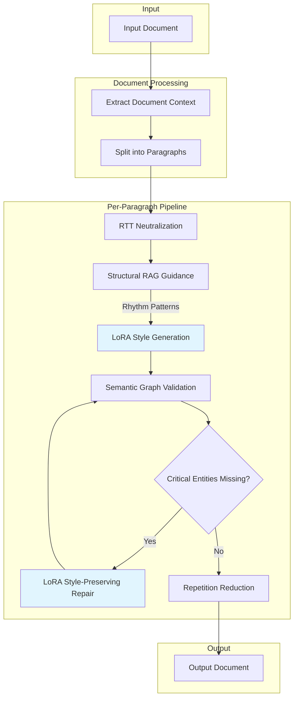
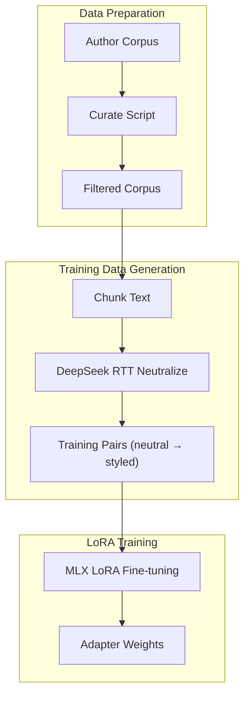
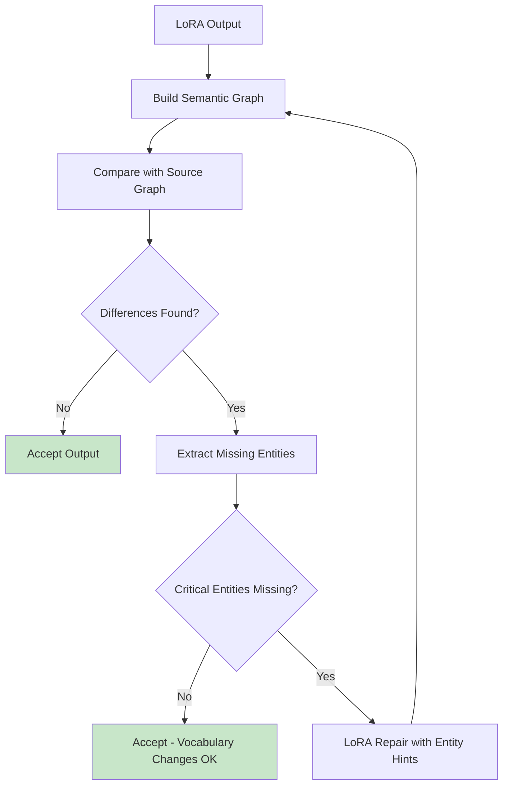
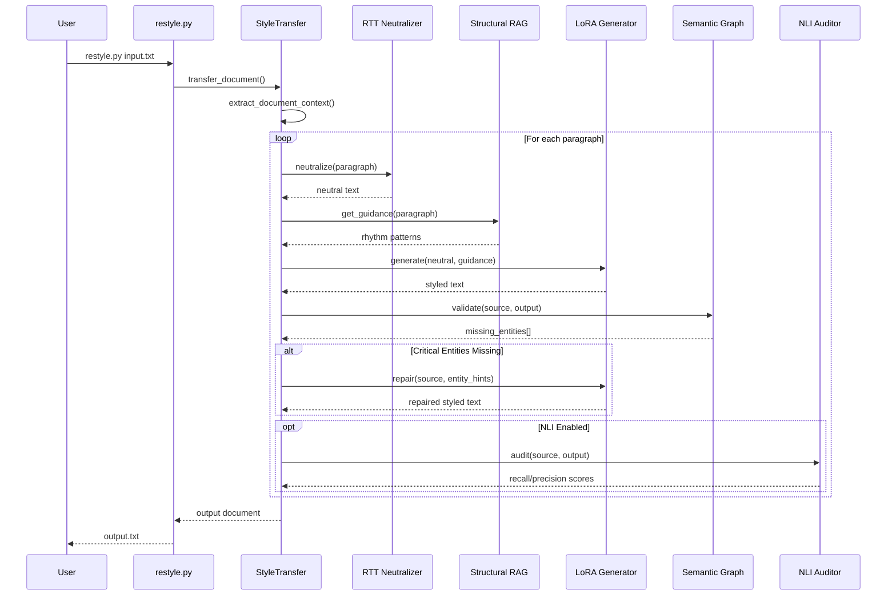

# Text Style Transfer

Transform text to match a target author's writing style while preserving semantic meaning. Uses LoRA-adapted language models for fast, consistent style transfer with semantic graph validation to ensure content fidelity.

## Features

- **LoRA-Based Generation**: Fine-tuned adapters capture author style in model weights
- **RTT Neutralization**: Round-trip translation strips style before restyling
- **Semantic Graph Validation**: Validates content preservation using proposition graphs
- **Style-Preserving Repair**: Uses LoRA for repairs to maintain author voice (not generic LLM)
- **Structural RAG**: Provides rhythm and syntax guidance from author corpus
- **NLI Auditor**: Optional sentence-level fact verification
- **Perspective Control**: Transform to first/third person while maintaining style
- **Interactive REPL**: Terminal UI for live style transfer with history and commands
- **Fast Transfer**: ~15-30 seconds per paragraph

## Requirements

- Python 3.9+
- Apple Silicon Mac (for MLX-based training/inference)
- ~8GB RAM for inference, ~50GB for training
- DeepSeek API key (for RTT neutralization)

---

## Installation

```bash
# Clone repository
git clone <repository-url>
cd text-style-transfer

# Create virtual environment
python3 -m venv venv
source venv/bin/activate

# Install dependencies
pip install -r requirements.txt

# Download spaCy model
python -m spacy download en_core_web_lg

# Copy config template
cp config.json.sample config.json
# Edit config.json to add your DEEPSEEK_API_KEY
```

---

## Quick Start

```bash
# Transfer text using an existing adapter
python restyle.py input.txt -o output.txt \
    --adapter lora_adapters/lovecraft \
    --author "H.P. Lovecraft"

# Interactive REPL mode for live style transfer
python restyle.py --repl --adapter lora_adapters/lovecraft

# List available adapters
python restyle.py --list-adapters

# Skip verification for faster output
python restyle.py input.txt -o output.txt \
    --adapter lora_adapters/lovecraft \
    --no-verify
```

### Interactive REPL Mode

The REPL provides an interactive terminal UI for live style transfer:

```bash
python restyle.py --repl --adapter lora_adapters/lovecraft --author "H.P. Lovecraft"
```

```
───────────────────────────────────────────────────────────────
─────────────── Style Transfer: H.P. Lovecraft ────────────────
───────────────────────────────────────────────────────────────

  Enter text to transform (press Enter twice to submit)
  Commands: /help, /clear, /history, /quit

│ The old house stood at the end of the street.
│

───────────────────────────────────────────────────────────────
  Output (23 words):
───────────────────────────────────────────────────────────────

  The ancient edifice loomed at the terminus of that forgotten
  thoroughfare, its gambrel roof silhouetted against a gibbous moon.

───────────────────────────────────────────────────────────────
```

**REPL Commands:**
| Command | Description |
|---------|-------------|
| `/help` | Show available commands |
| `/clear` | Clear the screen |
| `/history` | Show transformation history |
| `/last` | Show last transformation |
| `/quit` | Exit the REPL |

---

## Training a LoRA Adapter


### Step 1: Prepare Corpus

Create a plain text file with the author's writing. Place in `data/corpus/`:

| Requirement | Recommendation |
|-------------|----------------|
| **Size** | 50KB-500KB (~0.9M tokens optimal) |
| **Format** | Clean paragraphs separated by blank lines |
| **Content** | Representative prose samples |
| **Remove** | Headers, footnotes, citations |

For large corpuses, curate to optimal size:

```bash
python scripts/curate_corpus.py \
    --input data/corpus/author_raw.txt \
    --output data/corpus/author.txt \
    --target-tokens 900000
```

### Step 2: Generate Training Data

Creates training pairs using instruction back-translation. The script neutralizes styled text to create (neutral → styled) pairs:

```bash
python scripts/generate_flat_training.py \
    --corpus data/corpus/author.txt \
    --author "Author Name" \
    --output data/training/author
```

**Options:**

| Option | Default | Description |
|--------|---------|-------------|
| `--min-words` | 150 | Minimum words per chunk |
| `--max-words` | 400 | Maximum words per chunk |
| `--overlap-sentences` | 2 | Sentence overlap between chunks |

**Output:** `data/training/author.jsonl` with training pairs.

### Step 3: Train the LoRA Adapter

```bash
python scripts/train_mlx_lora.py \
    --from-neutralized data/training/author.jsonl \
    --author "Author Name" \
    --train \
    --output lora_adapters/author
```

**Options:**

| Option | Default | Description |
|--------|---------|-------------|
| `--epochs` | 1 | Training epochs (1 often sufficient) |
| `--batch-size` | 1 | Batch size |
| `--learning-rate` | 1e-5 | Learning rate |
| `--rank` | 64 | LoRA rank |
| `--alpha` | 128 | LoRA alpha (typically 2x rank) |
| `--resume` | - | Resume from checkpoint |

**Training time:** ~1-2 hours on Apple Silicon.

### Step 4: Verify Adapter

```bash
python restyle.py --list-adapters
python restyle.py test.txt -o output.txt --adapter lora_adapters/author -v
```

---

## Running Inference

### Basic Usage

```bash
python restyle.py <input> -o <output> --adapter <path> --author <name>
```

### CLI Options

| Option | Default | Description |
|--------|---------|-------------|
| `--adapter PATH` | - | Path to LoRA adapter (required) |
| `--author NAME` | - | Author name (auto-detected from metadata) |
| `--temperature` | 0.4 | Generation temperature |
| `--perspective` | preserve | Output perspective |
| `--no-verify` | false | Skip entailment verification |
| `--repl` | false | Start interactive REPL mode |
| `-v, --verbose` | false | Verbose output |

### Perspective Options

| Value | Description |
|-------|-------------|
| `preserve` | Keep source perspective (default) |
| `first_person_singular` | I, me, my |
| `first_person_plural` | we, us, our |
| `third_person` | he, she, they |
| `author_voice_third_person` | Write AS the author |

```bash
python restyle.py input.txt -o output.txt \
    --adapter lora_adapters/sagan \
    --perspective first_person_singular
```

---

## Project Structure

```
text-style-transfer/
├── restyle.py                    # Main CLI entry point
├── config.json                   # Configuration file
├── requirements.txt              # Python dependencies
│
├── src/                          # Source code
│   ├── generation/               # Style transfer pipeline
│   │   ├── transfer.py          # Main StyleTransfer class
│   │   ├── lora_generator.py    # MLX LoRA inference
│   │   └── document_context.py  # Document-level context
│   │
│   ├── validation/               # Content preservation
│   │   ├── semantic_graph.py    # Proposition graph analysis
│   │   ├── nli_auditor.py       # Sentence-level NLI verification
│   │   └── triplet_extractor.py # Subject-predicate-object extraction
│   │
│   ├── neutralization/           # Style stripping
│   │   └── openie_flatten.py    # RTT-based neutralization
│   │
│   ├── rag/                      # Structural RAG system
│   │   ├── style_analyzer.py    # spaCy style metrics
│   │   ├── corpus_indexer.py    # ChromaDB indexing
│   │   ├── structural_analyzer.py # Rhythm pattern analysis
│   │   └── structural_rag.py    # Rhythm/syntax guidance
│   │
│   ├── llm/                      # LLM providers
│   │   ├── provider.py          # Base provider interface
│   │   ├── mlx_provider.py      # MLX (local Apple Silicon)
│   │   ├── deepseek.py          # DeepSeek API
│   │   └── ollama.py            # Ollama (local)
│   │
│   ├── vocabulary/               # Post-processing
│   │   └── repetition_reducer.py # LLM-speak reduction
│   │
│   ├── repl/                     # Interactive REPL
│   │   └── repl.py              # Terminal UI for live transfer
│   │
│   └── utils/                    # Utilities
│       ├── nlp.py               # spaCy utilities
│       ├── prompts.py           # Prompt templates
│       └── logging.py           # Logging
│
├── scripts/                      # Training & data scripts
│   ├── curate_corpus.py         # Filter corpus to optimal size
│   ├── generate_flat_training.py # Generate training data via RTT
│   ├── train_mlx_lora.py        # Train LoRA adapter
│   └── blend_corpuses.py        # Blend author styles
│
├── prompts/                      # Prompt templates
│   ├── style_transfer.txt       # Main generation prompt
│   ├── nli_repair.txt           # NLI-based repair prompt
│   ├── document_context.txt     # Document analysis prompt
│   ├── rtt_deepseek.txt         # RTT neutralization (single)
│   ├── rtt_deepseek_batch.txt   # RTT neutralization (batch)
│   ├── rtt_to_mandarin.txt      # RTT step 1 (local MLX)
│   └── rtt_to_english.txt       # RTT step 2 (local MLX)
│
├── data/
│   ├── corpus/                   # Author corpus files
│   ├── training/                 # Generated training data
│   └── rag_index/                # ChromaDB persistent index
│
└── lora_adapters/                # Trained LoRA adapters
    └── <author>/
        ├── adapters.safetensors # LoRA weights
        ├── adapter_config.json  # LoRA config
        └── metadata.json        # Training metadata
```

---

## Architecture

### Inference Pipeline



**Key insight**: The repair loop uses the **same LoRA** as generation, not a generic LLM. This preserves the author's style during repairs. Vocabulary changes (the whole point of style transfer) are accepted; only missing named entities trigger repair.

### Training Pipeline



### Validation Flow



The semantic graph extracts propositions (subject-predicate-object) from both source and output. Only **named entities** (people, places, organizations, numbers) trigger repairs. Vocabulary style changes like "big" → "cyclopean" are accepted as intended behavior.

### Sequence Diagram



---

## Configuration

Copy `config.json.sample` to `config.json`:

```json
{
  "llm": {
    "provider": {
      "writer": "mlx",
      "critic": "deepseek",
      "rtt": "deepseek"
    },
    "providers": {
      "deepseek": {
        "api_key": "${DEEPSEEK_API_KEY}",
        "base_url": "https://api.deepseek.com",
        "model": "deepseek-chat",
        "max_tokens": 4096,
        "temperature": 0.7,
        "timeout": 120
      },
      "mlx": {
        "model": "mlx-community/Qwen3-8B-Base-bf16",
        "max_tokens": 256,
        "temperature": 0.2,
        "top_p": 0.9
      },
      "deepseek_rtt": {
        "model": "deepseek-chat",
        "max_tokens": 8192,
        "temperature": 0.1,
        "batch_size": 10,
        "concurrent_batches": 4
      }
    },
    "retry": {
      "max_attempts": 5,
      "base_delay": 2,
      "max_delay": 60
    }
  },
  "generation": {
    "entailment_threshold": 0.8,
    "max_repair_attempts": 1,
    "max_expansion_ratio": 3.0,
    "target_expansion_ratio": 1.2,
    "lora_scale": 1.0,
    "skip_neutralization": false,
    "reduce_repetition": true,
    "repetition_threshold": 3,
    "use_document_context": true,
    "pass_headings_unchanged": true,
    "min_paragraph_words": 10,
    "use_structural_rag": true,
    "use_sentence_nli": false,
    "nli_model": "cross-encoder/nli-deberta-v3-base",
    "nli_recall_threshold": 0.5,
    "nli_precision_threshold": 0.5
  },
  "style": {
    "perspective": "preserve"
  },
  "log_level": "INFO"
}
```

### LLM Provider Options

| Provider | Role | Description |
|----------|------|-------------|
| `writer` | Generation | Local MLX model with LoRA adapter |
| `critic` | Repair/Validation | API model for quality checks |
| `rtt` | Neutralization | API model for round-trip translation |

### Generation Options

| Option | Default | Description |
|--------|---------|-------------|
| `entailment_threshold` | 0.8 | Min NLI score for content preservation |
| `max_repair_attempts` | 1 | Max repair loop iterations |
| `max_expansion_ratio` | 3.0 | Max output/input word ratio |
| `target_expansion_ratio` | 1.2 | Target ratio for generation |
| `lora_scale` | 1.0 | LoRA influence (0.0=base, 1.0=full, >1.5 risks memorization) |
| `skip_neutralization` | false | Skip RTT, use original text directly |
| `reduce_repetition` | true | Enable LLM-speak word replacement |
| `repetition_threshold` | 3 | Words used N+ times get replaced |
| `use_document_context` | true | Extract document-level intent/tone |
| `pass_headings_unchanged` | true | Don't transform markdown headings |
| `min_paragraph_words` | 10 | Skip paragraphs shorter than N words |
| `use_structural_rag` | true | Enable rhythm/syntax guidance from corpus |

### NLI Auditor Options (Sentence-Level Verification)

| Option | Default | Description |
|--------|---------|-------------|
| `use_sentence_nli` | false | Enable sentence-level NLI (slower but more accurate) |
| `nli_model` | `cross-encoder/nli-deberta-v3-base` | CrossEncoder model for NLI |
| `nli_recall_threshold` | 0.5 | Min entailment probability for recall |
| `nli_precision_threshold` | 0.5 | Max contradiction probability for precision |

### Style Options

| Option | Values | Description |
|--------|--------|-------------|
| `perspective` | `preserve`, `first_person_singular`, `first_person_plural`, `third_person`, `author_voice_third_person` | Output point-of-view |

---

## Troubleshooting

### MLX Not Available

Requires Apple Silicon. For other platforms, use Ollama provider.

### Out of Memory

Use 4-bit model in config.json:
```json
"mlx": { "model": "mlx-community/Qwen3-8B-4bit" }
```

### Missing API Key

```bash
export DEEPSEEK_API_KEY="your-key"
```

### spaCy Model Missing

```bash
python -m spacy download en_core_web_lg
```

### Style Too Weak

Increase `lora_scale` in config.json to 1.5-2.0.

### Content Being Lost

Increase `entailment_threshold` to 0.9 and check for missing named entities in verbose output.

### Style Being Destroyed During Repair

This was a bug where generic LLM repair overwrote styled output. Now fixed: repairs use the LoRA to maintain author voice. Only missing named entities trigger repair; vocabulary changes are accepted.

### Facts Being Changed (Numbers, Dates, Names)

The LoRA may transform numbers to prose. Lower `lora_scale` to 0.5-0.8 for more factual preservation.

---

## Performance

| Metric | Value |
|--------|-------|
| Per-paragraph | 15-30 seconds |
| Memory (inference) | ~8GB |
| Memory (training) | ~50GB |
| Training time | ~1-2 hours |
| RAG indexing | ~30-60 seconds |

---

## License

MIT License - See LICENSE file for details.
