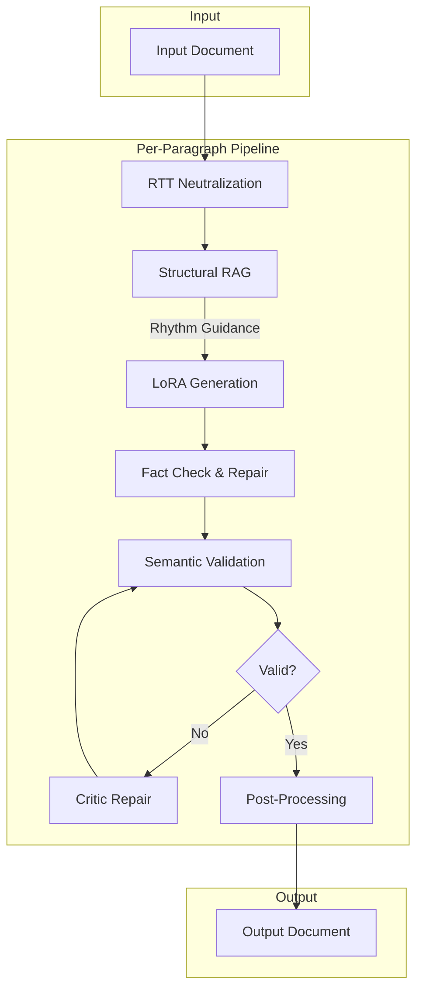
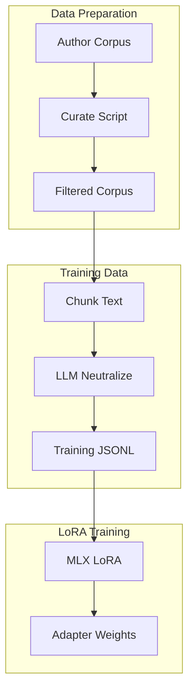
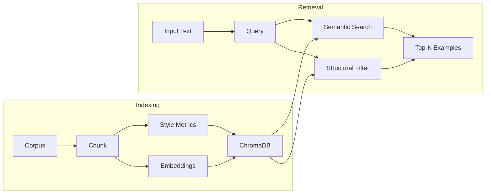
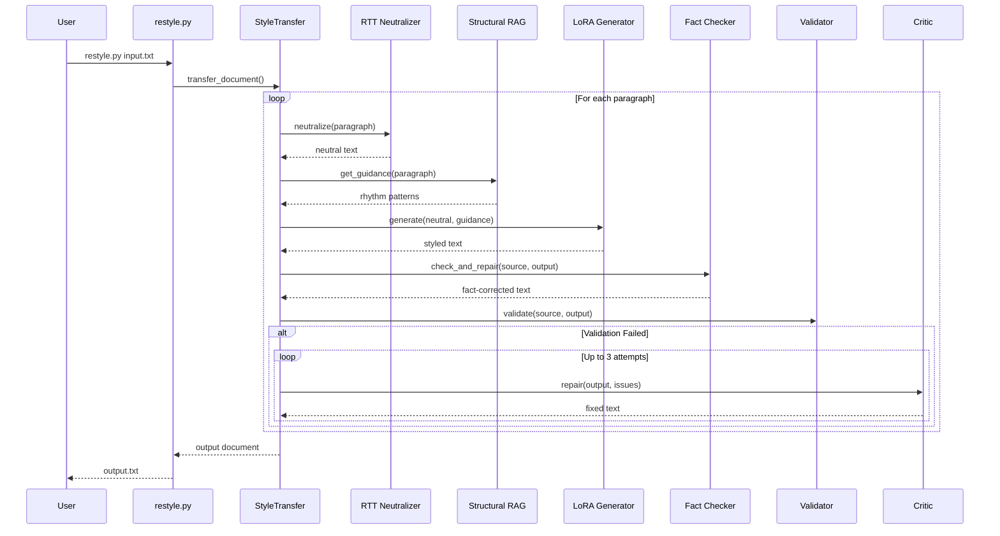

# Text Style Transfer

Transform text to match a target author's writing style while preserving semantic meaning. Uses LoRA-adapted language models for fast, consistent style transfer with a critic/repair loop to ensure content fidelity.

## Features

- **LoRA-Based Generation**: Fine-tuned adapters capture author style in model weights
- **RTT Neutralization**: Round-trip translation strips style before restyling
- **Semantic Graph Validation**: Validates content preservation using proposition graphs
- **Fact Checking & Repair**: Detects and repairs hallucinated numbers, dates, names
- **Style RAG**: Retrieves author examples for few-shot prompting
- **Structural RAG**: Provides rhythm and syntax guidance from author corpus
- **Perspective Control**: Transform to first/third person while maintaining style
- **Fast Transfer**: ~15-30 seconds per paragraph

## Requirements

- Python 3.9+
- Apple Silicon Mac (for MLX-based training/inference)
- ~8GB RAM for inference (4-bit), ~50GB for training
- DeepSeek API key (for critic/repair loop)

---

## Installation

```bash
# Clone repository
git clone <repository-url>
cd text-style-transfer

# Create virtual environment
python3 -m venv venv
source venv/bin/activate

# Install dependencies
pip install -r requirements.txt

# Download spaCy model
python -m spacy download en_core_web_sm

# Copy config template
cp config.json.sample config.json
# Edit config.json to add your DEEPSEEK_API_KEY
```

---

## Quick Start

```bash
# Transfer text using an existing adapter
python restyle.py input.txt -o output.txt \
    --adapter lora_adapters/lovecraft \
    --author "H.P. Lovecraft"

# List available adapters
python restyle.py --list-adapters
```

---

## Training a LoRA Adapter


### Step 1: Prepare Corpus

Create a plain text file with the author's writing. Place in `data/corpus/`:

| Requirement | Recommendation |
|-------------|----------------|
| **Size** | 50KB-500KB (~0.9M tokens optimal) |
| **Format** | Clean paragraphs separated by blank lines |
| **Content** | Representative prose samples |
| **Remove** | Headers, footnotes, citations |

For large corpuses, curate to optimal size:

```bash
python scripts/curate_corpus.py \
    --input data/corpus/author_raw.txt \
    --output data/corpus/author.txt \
    --target-tokens 900000
```

### Step 2: Generate Training Data

Creates training pairs using instruction back-translation. The script neutralizes styled text to create (neutral → styled) pairs:

```bash
python scripts/generate_flat_training.py \
    --corpus data/corpus/author.txt \
    --author "Author Name" \
    --output data/training/author
```

**Options:**

| Option | Default | Description |
|--------|---------|-------------|
| `--min-words` | 150 | Minimum words per chunk |
| `--max-words` | 400 | Maximum words per chunk |
| `--overlap-sentences` | 2 | Sentence overlap between chunks |

**Output:** `data/training/author.jsonl` with training pairs.

### Step 3: Train the LoRA Adapter

```bash
python scripts/train_mlx_lora.py \
    --from-neutralized data/training/author.jsonl \
    --author "Author Name" \
    --train \
    --output lora_adapters/author
```

**Options:**

| Option | Default | Description |
|--------|---------|-------------|
| `--epochs` | 1 | Training epochs (1 often sufficient) |
| `--batch-size` | 1 | Batch size |
| `--learning-rate` | 1e-5 | Learning rate |
| `--rank` | 64 | LoRA rank |
| `--alpha` | 128 | LoRA alpha (typically 2x rank) |
| `--resume` | - | Resume from checkpoint |

**Training time:** ~1-2 hours on Apple Silicon.

### Step 4: Verify Adapter

```bash
python restyle.py --list-adapters
python restyle.py test.txt -o output.txt --adapter lora_adapters/author -v
```

---

## Building the Style RAG

Style RAG retrieves stylistically similar passages from the author's corpus and injects them as few-shot examples, providing the model with exact vocabulary and sentence structures to mimic.


### Index a Corpus

```bash
python restyle.py --index-corpus data/corpus/lovecraft.txt \
    --author "H.P. Lovecraft"
```

This creates embeddings and style metrics for each paragraph chunk, stored in `data/rag_index/`.

### List Indexed Authors

```bash
python restyle.py --list-rag
```

### Use RAG During Transfer

```bash
python restyle.py input.txt -o output.txt \
    --adapter lora_adapters/lovecraft \
    --author "H.P. Lovecraft" \
    --rag \
    --rag-examples 3
```

The `--rag` flag enables retrieval of style examples that match the input text's topic and structure.

---

## Running Inference

### Basic Usage

```bash
python restyle.py <input> -o <output> --adapter <path> --author <name>
```

### CLI Options

| Option | Default | Description |
|--------|---------|-------------|
| `--adapter PATH` | - | Path to LoRA adapter (required) |
| `--author NAME` | - | Author name (auto-detected from metadata) |
| `--temperature` | 0.4 | Generation temperature |
| `--perspective` | preserve | Output perspective |
| `--no-verify` | false | Skip entailment verification |
| `--rag` | false | Enable Style RAG |
| `--rag-examples` | 3 | Number of RAG examples |
| `-v, --verbose` | false | Verbose output |

### Perspective Options

| Value | Description |
|-------|-------------|
| `preserve` | Keep source perspective (default) |
| `first_person_singular` | I, me, my |
| `first_person_plural` | we, us, our |
| `third_person` | he, she, they |
| `author_voice_third_person` | Write AS the author |

```bash
python restyle.py input.txt -o output.txt \
    --adapter lora_adapters/sagan \
    --perspective first_person_singular
```

---

## Project Structure

```
text-style-transfer/
├── restyle.py                    # Main CLI entry point
├── config.json                   # Configuration file
├── requirements.txt              # Python dependencies
│
├── src/                          # Source code
│   ├── generation/               # Style transfer pipeline
│   │   ├── transfer.py          # Main StyleTransfer class
│   │   ├── lora_generator.py    # MLX LoRA inference
│   │   └── document_context.py  # Document-level context
│   │
│   ├── validation/               # Content preservation
│   │   ├── semantic_graph.py    # Semantic graph analysis
│   │   ├── fact_checker.py      # Fact extraction and repair
│   │   └── quality_critic.py    # Entailment checking
│   │
│   ├── rag/                      # Style RAG system
│   │   ├── style_analyzer.py    # spaCy style metrics
│   │   ├── corpus_indexer.py    # ChromaDB indexing
│   │   ├── style_retriever.py   # Two-channel retrieval
│   │   ├── structural_rag.py    # Rhythm/syntax guidance
│   │   └── session_context.py   # Session context manager
│   │
│   ├── llm/                      # LLM providers
│   │   ├── mlx_provider.py      # MLX (local)
│   │   ├── deepseek.py          # DeepSeek API
│   │   └── ollama.py            # Ollama (local)
│   │
│   ├── vocabulary/               # Post-processing
│   │   └── repetition_reducer.py
│   │
│   └── utils/                    # Utilities
│       ├── nlp.py               # spaCy utilities
│       ├── prompts.py           # Prompt templates
│       └── logging.py           # Logging
│
├── scripts/                      # Training & data scripts
│   ├── curate_corpus.py         # Filter corpus to optimal size
│   ├── generate_flat_training.py # Generate training data
│   ├── train_mlx_lora.py        # Train LoRA adapter
│   └── blend_corpuses.py        # Blend author styles
│
├── prompts/                      # Prompt templates
│   ├── style_transfer.txt       # Main generation prompt
│   ├── repair_system.txt        # Semantic repair system
│   ├── repair_input.txt         # Semantic repair input
│   ├── fact_repair_system.txt   # Fact repair system
│   ├── fact_repair_input.txt    # Fact repair input
│   ├── document_context.txt     # Document analysis
│   ├── rtt_deepseek.txt         # RTT neutralization
│   └── quality_repair.txt       # Quality repair
│
├── data/
│   ├── corpus/                   # Author corpus files
│   ├── training/                 # Generated training data
│   └── rag_index/                # ChromaDB index
│
└── lora_adapters/                # Trained LoRA adapters
    └── <author>/
        ├── adapters.safetensors # LoRA weights
        ├── adapter_config.json  # LoRA config
        └── metadata.json        # Training metadata
```

---

## Architecture

### Inference Pipeline



### Training Pipeline



### Style RAG System



### Sequence Diagram



---

## Configuration

Copy `config.json.sample` to `config.json`:

```json
{
  "llm": {
    "provider": {
      "writer": "mlx",
      "critic": "deepseek",
      "rtt": "mlx"
    },
    "providers": {
      "deepseek": {
        "api_key": "${DEEPSEEK_API_KEY}",
        "model": "deepseek-chat"
      },
      "mlx": {
        "model": "mlx-community/Qwen3-8B-4bit"
      }
    }
  },
  "generation": {
    "temperature": 0.4,
    "verify_entailment": true,
    "entailment_threshold": 0.7,
    "max_repair_attempts": 3,
    "lora_scale": 2.0,
    "reduce_repetition": true,
    "use_structural_rag": true,
    "verify_facts": true
  }
}
```

### Key Options

| Option | Default | Description |
|--------|---------|-------------|
| `lora_scale` | 2.0 | LoRA influence (higher = stronger style) |
| `entailment_threshold` | 0.7 | Validation strictness |
| `max_repair_attempts` | 3 | Repair loop iterations |
| `temperature` | 0.4 | Generation randomness |
| `use_structural_rag` | true | Enable rhythm/syntax guidance |
| `verify_facts` | true | Enable fact checking and repair |

---

## Troubleshooting

### MLX Not Available

Requires Apple Silicon. For other platforms, use Ollama.

### Out of Memory

Use 4-bit model in config.json:
```json
"mlx": { "model": "mlx-community/Qwen3-8B-4bit" }
```

### Missing API Key

```bash
export DEEPSEEK_API_KEY="your-key"
```

### spaCy Model Missing

```bash
python -m spacy download en_core_web_sm
```

### Style Too Weak

Increase `lora_scale` in config.json to 2.0-3.0.

### Content Being Lost

Increase `max_repair_attempts` to 5 and `entailment_threshold` to 0.8.

### Facts Being Changed (Numbers, Dates, Names)

The LoRA may convert numbers to words or hallucinate facts. Ensure `verify_facts` is enabled (default). For fact-heavy text, also try lowering `lora_scale` to 1.0-1.5.

---

## Performance

| Metric | Value |
|--------|-------|
| Per-paragraph | 15-30 seconds |
| Memory (inference) | ~8GB |
| Memory (training) | ~50GB |
| Training time | ~1-2 hours |
| RAG indexing | ~30-60 seconds |

---

## License

MIT License - See LICENSE file for details.
