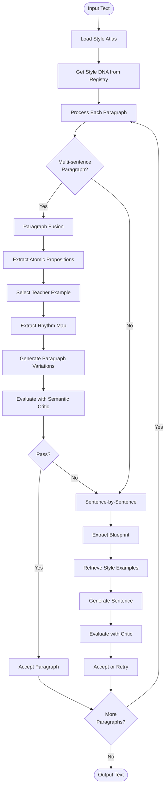

# Text Style Transfer

Transform text to match a target author's style while preserving semantic meaning. Uses a Style Atlas architecture with RAG-based retrieval, paragraph fusion, and semantic validation.

## Quick Start

### Installation

```bash
# Create virtual environment
python3 -m venv venv
source venv/bin/activate  # On Windows: venv\Scripts\activate

# Install dependencies
pip install -r requirements.txt

# Download NLTK data (automatic on first run, or manually):
python3 -c "import nltk; nltk.download('punkt_tab'); nltk.download('stopwords'); nltk.download('averaged_perceptron_tagger_eng')"
```

### Configuration

1. Copy `config.json` and set your API key:
   ```json
   {
     "provider": "deepseek",
     "deepseek": {
       "api_key": "your-api-key-here"
     },
     "blend": {
       "authors": ["Mao"]
     }
   }
   ```

2. Load author styles into ChromaDB:
   ```bash
   python3 scripts/load_style.py --style-file styles/sample_mao.txt --author "Mao"
   ```

3. Transform text:
   ```bash
   python3 restyle.py input/small.md -o output/small.md
   ```

## Usage

### Loading Author Styles

Load author styles into ChromaDB using `scripts/load_style.py`:

```bash
# Single author
python3 scripts/load_style.py --style-file styles/sample_mao.txt --author "Mao"

# Multiple authors
python3 scripts/load_style.py \
  --style-file styles/sample_hemingway.txt --author "Hemingway" \
  --style-file styles/sample_lovecraft.txt --author "Lovecraft"
```

### Transforming Text

```bash
# Basic usage
python3 restyle.py input/small.md -o output/small.md

# With options
python3 restyle.py input/small.md -o output/small.md \
  --max-retries 5 \
  --verbose
```

**CLI Options:**
- `input`: Input text file (required)
- `-o, --output`: Output file path (required)
- `-c, --config`: Config file path (default: `config.json`)
- `--max-retries`: Max retry attempts per sentence (default: 3)
- `--atlas-cache`: ChromaDB persistence directory (overrides config)
- `-v, --verbose`: Enable verbose output

### Python API

```python
from src.pipeline import run_pipeline

output = run_pipeline(
    input_file="input/small.md",
    output_file="output/small.md",
    config_path="config.json",
    verbose=True
)
```

## Configuration

### Provider Settings

```json
{
  "provider": "deepseek",
  "deepseek": {
    "api_key": "your-api-key-here",
    "api_url": "https://api.deepseek.com/v1/chat/completions",
    "editor_model": "deepseek-chat",
    "critic_model": "deepseek-chat"
  }
}
```

Supported providers: `deepseek`, `ollama`, `glm`, `gemini`

### Author Configuration

```json
{
  "blend": {
    "authors": ["Mao"]
  }
}
```

The first author in the list is used. Style DNA is loaded from the Style Registry (`atlas_cache/author_profiles.json`).

### Key Configuration Sections

**Paragraph Fusion** (paragraph-level generation):
```json
{
  "paragraph_fusion": {
    "enabled": true,
    "min_sentences_for_fusion": 2,
    "proposition_recall_threshold": 0.8,
    "meaning_weight": 0.6,
    "style_alignment_weight": 0.4,
    "num_variations": 5
  }
}
```

**Semantic Critic** (validation thresholds):
```json
{
  "semantic_critic": {
    "recall_threshold": 0.85,
    "precision_threshold": 0.50,
    "similarity_threshold": 0.7,
    "fluency_threshold": 0.8
  }
}
```

**Atlas** (Style Atlas settings):
```json
{
  "atlas": {
    "persist_path": "atlas_cache/",
    "num_clusters": 5,
    "min_structure_words": 4,
    "max_length_ratio": 1.8,
    "min_length_ratio": 0.6
  }
}
```

**Translator** (generation parameters):
```json
{
  "translator": {
    "temperature": 0.5,
    "max_tokens": 300
  }
}
```

**Critic** (evaluation settings):
```json
{
  "critic": {
    "min_score": 0.6,
    "max_retries": 5,
    "good_enough_threshold": 0.8
  }
}
```

## Project Structure

```
text-style-transfer/
├── src/
│   ├── pipeline.py              # Main pipeline orchestration
│   ├── atlas/
│   │   ├── builder.py          # Style Atlas construction
│   │   ├── navigator.py        # RAG retrieval
│   │   └── style_registry.py   # Style DNA storage
│   ├── generator/
│   │   ├── translator.py       # Text generation
│   │   └── mutation_operators.py # Prompt templates
│   ├── validator/
│   │   └── semantic_critic.py  # Validation
│   ├── analyzer/
│   │   ├── style_extractor.py  # Style DNA extraction
│   │   └── structuralizer.py   # Rhythm extraction
│   └── analysis/
│       └── semantic_analyzer.py # Proposition extraction
├── prompts/                     # LLM prompt templates (markdown)
├── scripts/
│   ├── load_style.py           # Load author styles
│   ├── list_styles.py          # List loaded authors
│   └── clear_chromadb.py       # Clear ChromaDB
├── config.json                 # Configuration
└── restyle.py                  # CLI entry point
```

## How It Works

### Pipeline Flow



### Key Components

1. **Style Atlas**: ChromaDB-based vector store with dual embeddings (semantic + style) and K-means clustering
2. **Paragraph Fusion**: For multi-sentence paragraphs, extracts atomic propositions and generates cohesive paragraphs matching human rhythm patterns
3. **Structural Cloning**: Extracts sentence rhythm (length, type, opener) from examples and forces LLM to match it exactly
4. **Semantic Critic**: Validates generated text using proposition recall and style alignment metrics
5. **Style Registry**: Sidecar JSON storage for author Style DNA profiles

### Paragraph Fusion Process

1. Extract atomic propositions from input paragraph
2. Retrieve complex style examples from atlas
3. Select "teacher example" with sentence count matching `ceil(n_props * 0.6)`
4. Extract rhythm map (sentence length, type, opener) from teacher
5. Generate variations using structural blueprint
6. Evaluate with semantic critic (proposition recall + style alignment)
7. Select best candidate or trigger repair loop if recall is low

### Sentence-by-Sentence Fallback

If paragraph fusion fails or is disabled:
1. Extract semantic blueprint (SVO triples, entities, keywords)
2. Classify rhetorical type (observation, argument, etc.)
3. Retrieve style examples by rhetorical type
4. Generate sentence with style constraints
5. Evaluate and refine iteratively

## Testing

Run tests:
```bash
python3 tests/test_paragraph_rhythm_extraction.py
python3 tests/test_translate_paragraph_contract.py
python3 tests/test_pipeline_fallback_contract.py
```

## Troubleshooting

**Atlas not found**: Load styles first using `scripts/load_style.py`

**Author not found**: Check `blend.authors` in config.json matches loaded author names

**Low quality output**: Adjust `paragraph_fusion.proposition_recall_threshold` or `semantic_critic.recall_threshold`

**Import errors**: Ensure virtual environment is activated and dependencies are installed
