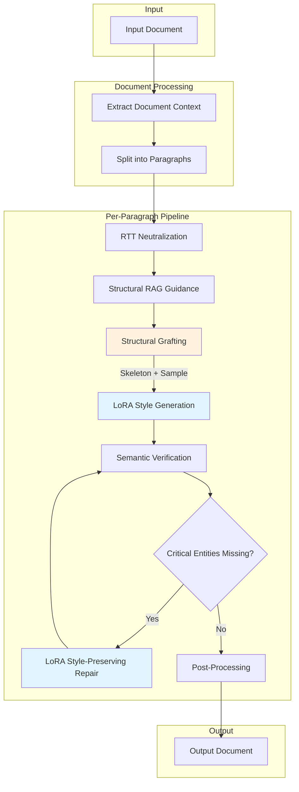

# Text Style Transfer

Transform text to match a target author's writing style while preserving semantic meaning. Uses LoRA-adapted language models for fast, consistent style transfer with semantic verification to ensure content fidelity.

## Features

- **LoRA-Based Generation**: Fine-tuned adapters capture author style in model weights
- **Multiple Adapter Blending**: Combine multiple author styles with individual scales
- **Checkpoint Support**: Test specific training checkpoints without overwriting finals
- **RTT Neutralization**: Round-trip translation strips style before restyling
- **Semantic Verification**: Validates content preservation using NLI entailment and entity checking
- **Structural Grafting**: Copies rhetorical structure (argument flow) from author samples
- **Structural RAG**: Provides rhythm and syntax guidance from author corpus
- **Persona Prompting**: Dense academic prose patterns to evade AI detection
- **Perspective Control**: Transform to first/third person while maintaining style
- **Interactive REPL**: Terminal UI with 5 variations per paragraph
- **Fast Transfer**: ~15-30 seconds per paragraph

## Requirements

- Python 3.9+
- Apple Silicon Mac (for MLX-based training/inference)
- Memory requirements (depends on model size):
  - 14B model (recommended): ~16GB for inference, ~40GB for training
  - 7B model: ~8GB for inference, ~20GB for training
- DeepSeek API key (for RTT neutralization and skeleton extraction)

---

## Installation

```bash
# Clone repository
git clone <repository-url>
cd text-style-transfer

# Create virtual environment
python3 -m venv venv
source venv/bin/activate

# Install dependencies
pip install -r requirements.txt

# Download spaCy model
python -m spacy download en_core_web_lg

# Copy config template and add your API key
cp config.json.sample config.json
# Edit config.json to add your DEEPSEEK_API_KEY
```

## Create MLX 4-bit Model

Download and quantize a base model for training and inference. The 14B model offers the best balance of quality and memory usage.

```bash
mkdir -p models

# Recommended: 14B model (~40GB memory for training, ~16GB for inference)
mlx_lm.convert --hf-path Qwen/Qwen2.5-14B \
    --q-bits 4 \
    --mlx-path models/Qwen2.5-14B-Base-4bit-MLX

# Alternative: 32B model (~64GB memory, higher quality)
mlx_lm.convert --hf-path Qwen/Qwen2.5-32B \
    --q-bits 4 \
    --mlx-path models/Qwen2.5-32B-Base-4bit-MLX

# Alternative: 8B model (~16GB memory, fastest)
mlx_lm.convert --hf-path Qwen/Qwen2.5-7B \
    --q-bits 4 \
    --mlx-path models/Qwen2.5-7B-Base-4bit-MLX
```

**Model selection guide:**

| Model | Training Memory | Inference Memory | Quality |
|-------|-----------------|------------------|---------|
| Qwen2.5-7B-4bit | ~20GB | ~8GB | Good |
| **Qwen2.5-14B-4bit** | ~40GB | ~16GB | **Recommended** |
| Qwen2.5-32B-4bit | ~64GB+ | ~24GB | Highest |

**Important:** Use base models (not Instruct) for style training - they learn style patterns better without instruction-following biases.

---

## Building a LoRA Adapter from Scratch

This section walks through the complete process of creating a style transfer adapter from author text.


**Quick Reference:**

```bash
# 1. Curate corpus (filter to optimal size)
python scripts/curate_corpus.py --input raw.txt --output corpus.txt --target-tokens 900000

# 2. Generate training data (variations, neutralization, formatting)
python scripts/generate_flat_training.py --corpus corpus.txt --author "Author" --output data/training/author

# 3. Index for inference RAG (Structural Grafting, rhythm retrieval)
python scripts/load_corpus.py --input corpus.txt --author "Author"

# 4. Train LoRA (create config.yaml first - see Step 4)
mlx_lm.lora --config data/training/author/config.yaml

# 5. Configure persona (create prompts/author_persona.txt, update config.json)
# See Step 5 below for file format
```

---

### Step 1: Curate Your Corpus

Gather representative text samples from your target author. The corpus quality directly affects output quality.

**Corpus Requirements:**

| Requirement | Recommendation |
|-------------|----------------|
| **Size** | 50KB-500KB of text (~50-500 paragraphs) |
| **Format** | Plain text, paragraphs separated by blank lines |
| **Content** | Representative prose samples showing author's style |
| **Quality** | Remove headers, footers, page numbers, excessive citations |

**Example raw corpus:**

```
data/corpus/lovecraft_raw.txt
```

```text
The oldest and strongest emotion of mankind is fear, and the
oldest and strongest kind of fear is fear of the unknown.

I have seen the dark universe yawning where the black planets
roll without aim, where they roll in their horror unheeded...

[more paragraphs separated by blank lines]
```

#### Curating the Corpus (Recommended)

If your raw corpus is large or contains noise, use the curation script to filter and select the best passages:

```bash
python scripts/curate_corpus.py \
    --input data/corpus/lovecraft_raw.txt \
    --output data/corpus/lovecraft.txt \
    --target-tokens 900000
```

**What curation does:**

1. **Filters** low-quality text (short paragraphs, OCR artifacts, fragments)
2. **Selects** diverse, representative passages using embedding clustering
3. **Caps** output at target token budget (~900K tokens optimal)

**Options:**

| Option | Default | Description |
|--------|---------|-------------|
| `--target-tokens` | 900000 | Target corpus size in tokens |
| `--min-words` | 40 | Minimum words per paragraph |
| `--diversity-weight` | 0.3 | Balance between quality (0) and diversity (1) |

**When to curate:**

- Raw corpus > 500KB (will be trimmed to optimal size)
- Corpus contains OCR'd books (removes artifacts)
- Corpus has mixed quality (selects best passages)

**When to skip curation:**

- Corpus is already clean and well-formatted
- Corpus is small (<100KB) - use directly

**Tips for manual preparation:**

- Include diverse samples (essays, books, articles) to capture style range
- Ensure paragraphs are complete thoughts (not fragments)
- Remove chapter headers, page numbers, and footnotes
- Aim for paragraphs of 30-300 words each

#### Chunking the Corpus (Optional)

If you want explicit control over chunk boundaries, use `chunk_corpus.py` to create overlapping chunks:

```bash
python scripts/chunk_corpus.py \
    --corpus data/corpus/lovecraft.txt \
    --output data/training/lovecraft/chunks.json \
    --target-words 150 \
    --overlap 2
```

This creates ~150-word chunks with 2-sentence overlap (style lives in transitions). You can then pass these to `generate_flat_training.py` with `--resume-from-chunks`.

**Note:** If you skip this step, `generate_flat_training.py` does chunking automatically.

### Step 2: Generate Training Data

This step creates training pairs by neutralizing the author's styled text. The training format is `(neutral_text → styled_text)`, teaching the model to add style while preserving content.

```bash
python scripts/generate_flat_training.py \
    --corpus data/corpus/lovecraft.txt \
    --author "H.P. Lovecraft" \
    --output data/training/lovecraft
```

**What this does:**

1. **Extracts** quality paragraphs from corpus
2. **Creates variations** using the Triad Strategy (1:3 expansion):
   - **Anchors**: Original author text
   - **Snowflakes**: LLM-generated topic variations (same sentence structure, mundane topics like "making coffee" or "folding laundry")
   - **Robustness**: Original text marked for heavy input perturbation
3. **Chunks** into training-sized segments with overlapping context (150-400 words)
4. **Neutralizes ALL chunks** (both originals AND snowflakes) via Round-Trip Translation
5. **Creates** training pairs for EACH:
   - Originals: `neutral(original) → styled(original)` — teaches vocabulary
   - Snowflakes: `neutral(snowflake) → styled(snowflake)` — teaches structure
6. **Splits** into train/validation/test sets (80/10/10)

**Why Snowflakes Work:**

The key insight is that snowflakes are **styled text first**, then neutralized. The model learns:
- `neutral(tomato facts) → styled(tomato passage)` — author's vocabulary
- `neutral(snowflake facts) → styled(snowflake passage)` — author's sentence structure

Since the snowflake is about a mundane topic (not tomatoes), the model can't rely on content similarity—it must learn the **transformation function** itself. This prevents content overfitting.

**Options:**

| Option | Default | Description |
|--------|---------|-------------|
| `--min-words` | 150 | Minimum words per training chunk |
| `--max-words` | 400 | Maximum words per training chunk |
| `--overlap-sentences` | 2 | Sentence overlap between chunks for context |
| `--skip-variation` | - | Skip Triad variation (faster, but less robust training) |
| `--workers` | 1 | Parallel workers for variation generation |

**Output files:**

```
data/training/lovecraft/
├── all.jsonl         # All training data with metadata
├── train.jsonl       # Training set (80%)
├── valid.jsonl       # Validation set (10%)
├── test.jsonl        # Test set (10%)
├── paragraphs.json   # Intermediate: extracted paragraphs + variations
└── chunks.json       # Intermediate: overlapping chunks
```

**Training data format (text completion for base models):**

```json
{
  "text": "Write a 150 word excerpt about the content below emulating the style and voice of H.P. Lovecraft\n\n[neutralized text]\n\n[original styled text]"
}
```

The model learns: given instruction + neutral content → generate styled output.

### Step 3: Index Corpus in ChromaDB (for Inference)

The corpus indexer stores your text in ChromaDB for retrieval **during inference**. This enables Structural RAG (rhythm guidance) and Structural Grafting (argument structure copying). This step is independent of training.

```bash
python scripts/load_corpus.py \
    --input data/corpus/lovecraft.txt \
    --author "H.P. Lovecraft"
```

**What this does:**

1. **Splits** corpus into paragraphs
2. **Filters** for quality (removes short, broken, or repetitive paragraphs)
3. **Deduplicates** using semantic similarity (removes near-duplicates)
4. **Analyzes** style metrics per paragraph (sentence length, complexity, POS ratios)
5. **Generates** embeddings for semantic search
6. **Extracts** rhetorical skeletons via LLM (argument structure like `[Observation] → [Analysis] → [Conclusion]`)
7. **Stores** everything in ChromaDB at `data/rag_index/`

**Options:**

| Option | Description |
|--------|-------------|
| `--min-words 30` | Minimum words per paragraph (default: 30) |
| `--skip-skeletons` | Skip skeleton extraction (faster, but disables Structural Grafting) |
| `--clear` | Clear existing data for this author before loading |
| `--no-dedup` | Skip deduplication |
| `-v` | Verbose output showing rejection reasons |

**Verify indexing:**

```bash
# List all indexed authors and chunk counts
python scripts/load_corpus.py --list
```

Output:
```
Indexed authors (1):
--------------------------------------------------
  H.P. Lovecraft: 127 chunks (98 with skeletons, 77%)
```

### Step 4: Train the LoRA Adapter

Train a LoRA adapter using MLX. First, create a configuration file, then run training.

**Create `data/training/lovecraft/config.yaml`:**

```yaml
# MLX LoRA Configuration
model: "./models/Qwen2.5-14B-Base-4bit-MLX"  # Local 4-bit model
train: true
data: "data/training/lovecraft"

# Training Strategy
batch_size: 1
grad_accumulation: 4     # Effective batch = 4
grad_checkpoint: true    # Required for larger models
iters: 2100              # Adjust based on dataset size (~0.6 epochs)
learning_rate: 1e-5

# Apply LoRA to layers (-1 = all, or use 16 for memory constraints)
num_layers: -1           # Use 16 if running out of memory

# LoRA Architecture
lora_parameters:
  rank: 64               # High rank for complex sentence structures
  scale: 2.0             # Strong style signal
  dropout: 0.1           # Prevents overfitting to specific keywords
  keys:                  # Target attention + MLP layers
    - "self_attn.q_proj"
    - "self_attn.k_proj"
    - "self_attn.v_proj"
    - "self_attn.o_proj"
    - "mlp.gate_proj"
    - "mlp.up_proj"
    - "mlp.down_proj"

# Output
adapter_path: "lora_adapters/lovecraft"
save_every: 200          # Save checkpoints frequently
steps_per_report: 10
steps_per_eval: 200

seed: 42
```

**Run training:**

```bash
mlx_lm.lora --config data/training/lovecraft/config.yaml
```

**Key configuration parameters:**

| Parameter | Recommended | Description |
|-----------|-------------|-------------|
| `model` | `./models/Qwen2.5-14B-Base-4bit-MLX` | Local 4-bit model (base models work best) |
| `iters` | ~2000-3000 | Training steps (~0.6-0.9 epochs prevents overfitting) |
| `batch_size` | 1 | Small batches learn individual style quirks |
| `grad_accumulation` | 4 | Effective batch size = batch_size × grad_accumulation |
| `grad_checkpoint` | true | Required for 14B+ models to fit in memory |
| `learning_rate` | 1e-5 | Lower LR with high rank for stability |
| `num_layers` | -1 or 16 | All layers (-1) or last 16 if memory constrained |
| `rank` | 64 | Higher rank captures complex syntactic patterns |
| `dropout` | 0.1 | Forces model to learn structure, not memorize words |

**Calculating iterations:**

```
train_examples = number of lines in train.jsonl
iters_per_epoch = train_examples / batch_size
target_iters = iters_per_epoch × 0.87  # ~87% of one epoch
```

**Training time:** ~2-4 hours on Apple Silicon M1/M2/M3 (14B model).

**Output structure:**

```
lora_adapters/lovecraft/
├── adapters.safetensors       # Final LoRA weights
├── 0000200_adapters.safetensors  # Checkpoint at iter 200
├── 0000400_adapters.safetensors  # Checkpoint at iter 400
├── ...
└── adapter_config.json        # LoRA configuration (auto-generated)
```

**Create metadata.json (required for inference):**

After training, create `lora_adapters/lovecraft/metadata.json`:

```json
{
    "author": "H.P. Lovecraft",
    "base_model": "./models/Qwen2.5-14B-Base-4bit-MLX",
    "lora_rank": 64,
    "lora_alpha": 128,
    "training_examples": 3770
}
```

This file tells the inference pipeline which base model to load with the adapter. Without it, the system defaults to the wrong model and fails.

### Step 5: Configure Author Persona

Create a persona file with the exact persona frames used during training. These frames trigger the LoRA style at inference time.

**Create `prompts/{author}_persona.txt`:**

```
[PERSONA_FRAMES_NARRATIVE]
{Frame for narrative content - must match training exactly}
---
{Another narrative frame}
---
{Third narrative frame}

[PERSONA_FRAMES_CONCEPTUAL]
{Frame for conceptual/explanatory content - must match training exactly}
---
{Another conceptual frame}
---
{Third conceptual frame}
```

**Critical:** The persona frames must **exactly match** the frames used in `generate_flat_training.py`. The LoRA was trained on these specific phrases - using different frames at inference will not trigger the learned style. Copy the frames directly from the training script's `PERSONA_FRAMES` dictionary.

**Update `config.json`:**

```json
"lora": {
  "worldview": "lovecraft_persona.txt"
}
```

See `prompts/lovecraft_worldview.txt` for a complete example.

### Step 6: Verify and Test

Verify the adapter was created and test it:

```bash
# List available adapters
python restyle.py --list-adapters

# Test with a sample file
echo "The brain processes information through neural networks." > test_input.txt

python restyle.py test_input.txt -o test_output.txt \
    --adapter lora_adapters/lovecraft \
    --author "H.P. Lovecraft" \
    -v

cat test_output.txt
```

**Expected output:** The neutral input should be transformed into Lovecraft's characteristic style with self-referential observations, playful analogies, and philosophical tangents.

---

## Quick Start

Once you have a trained adapter, use it to transfer text:

```bash
# Transfer using config.json adapters (simplest)
python restyle.py input.txt -o output.txt --author "H.P. Lovecraft"

# Transfer with CLI adapter and scale
python restyle.py input.txt -o output.txt \
    --adapter lora_adapters/lovecraft:0.3 \
    --author "H.P. Lovecraft"

# Use a specific checkpoint
python restyle.py input.txt -o output.txt \
    --adapter lora_adapters/lovecraft:0.3 \
    --checkpoint 0000600_adapters.safetensors \
    --author "H.P. Lovecraft"

# Interactive REPL mode (generates 5 variations per input)
python restyle.py --repl \
    --adapter lora_adapters/lovecraft \
    --author "H.P. Lovecraft"

# Skip verification for faster output
python restyle.py input.txt -o output.txt \
    --adapter lora_adapters/lovecraft \
    --no-verify
```

---

## Interactive REPL Mode

The REPL provides an interactive terminal UI for live style transfer with **5 variations** per input:

```bash
python restyle.py --repl --adapter lora_adapters/lovecraft --author "H.P. Lovecraft"
```

```
───────────────────────────────────────────────────────────────
────────────── Style Transfer: H.P. Lovecraft ─────────────
───────────────────────────────────────────────────────────────

  Enter a paragraph to transform (press Enter twice to submit)
  Generates 5 variations for comparison
  Commands: /help, /clear, /history, /quit

│ The brain is a complex organ that processes information.
│

───────────────────────────────────────────────────────────────
  5 Variations Generated:
───────────────────────────────────────────────────────────────

  [1] (28 words)
  ──────────────────────────────────────────────────────────────
  The brain—that most peculiar of organs—engages in what we might
  call "information processing," though this term barely scratches
  the surface of its strange loops.

  [2] (25 words)
  ──────────────────────────────────────────────────────────────
  Consider the brain: a tangled hierarchy of neurons, each blind
  to meaning, yet collectively conjuring the very consciousness
  pondering them.

  ...
───────────────────────────────────────────────────────────────
```

**How it works:**

1. Enter a paragraph (press Enter twice to submit)
2. Text is neutralized via Round-Trip Translation (RTT)
3. LoRA generates 5 variations for comparison
4. Choose the best variation for your document

**REPL Commands:**

| Command | Description |
|---------|-------------|
| `/help` | Show available commands |
| `/clear` | Clear the screen |
| `/history` | Show transformation history |
| `/last` | Show last transformation |
| `/quit` | Exit the REPL |

---

## CLI Reference

### Basic Usage

```bash
# Using adapter from CLI
python restyle.py <input> -o <output> --adapter <path> --author <name>

# Using adapters from config.json (no --adapter needed)
python restyle.py <input> -o <output> --author <name>
```

### Options

| Option | Default | Description |
|--------|---------|-------------|
| `--adapter PATH[:SCALE]` | - | Path to LoRA adapter with optional scale. Can be specified multiple times to blend styles. |
| `--author NAME` | - | Author name (auto-detected from metadata) |
| `--lora-scale` | 1.0 | Default scale for adapters without inline scale |
| `--checkpoint` | - | Checkpoint file for first adapter (e.g., `0000600_adapters.safetensors`) |
| `--temperature` | 0.4 | Generation temperature |
| `--perspective` | preserve | Output perspective |
| `--no-verify` | false | Skip entailment verification |
| `--repl` | false | Start interactive REPL mode |
| `-v, --verbose` | false | Verbose output |

### Multiple Adapters

Blend multiple author styles by specifying `--adapter` multiple times:

```bash
# Blend two styles with different weights
python restyle.py input.txt -o output.txt \
    --adapter lora_adapters/lovecraft:0.4 \
    --adapter lora_adapters/poe:0.3 \
    --author "Blended Horror"

# Use default scale from --lora-scale
python restyle.py input.txt -o output.txt \
    --adapter lora_adapters/sagan \
    --lora-scale 0.5 \
    --author "Carl Sagan"
```

### Using Checkpoints

Test specific training checkpoints without overwriting the final adapter:

```bash
# Use a specific checkpoint
python restyle.py input.txt -o output.txt \
    --adapter lora_adapters/lovecraft \
    --checkpoint 0000600_adapters.safetensors \
    --author "H.P. Lovecraft"

# Or with inline scale
python restyle.py input.txt -o output.txt \
    --adapter lora_adapters/lovecraft:0.5 \
    --checkpoint 0000600_adapters.safetensors \
    --author "H.P. Lovecraft"
```

### Perspective Options

| Value | Description |
|-------|-------------|
| `preserve` | Keep source perspective (default) |
| `first_person_singular` | I, me, my |
| `first_person_plural` | we, us, our |
| `third_person` | he, she, they |
| `author_voice_third_person` | Write AS the author |

```bash
python restyle.py input.txt -o output.txt \
    --adapter lora_adapters/sagan \
    --perspective first_person_singular
```

---

## Architecture

### Inference Pipeline



**Key Components:**

- **RTT Neutralization**: Strips source style via English → Mandarin → English translation
- **Structural RAG**: Retrieves rhythm patterns (sentence length distribution, complexity) from corpus
- **Structural Grafting**: Finds semantically similar passage, extracts its rhetorical skeleton, injects as blueprint
- **Semantic Verification**: NLI entailment + entity checking; only missing entities trigger repair
- **Post-Processing**: Grammar correction, sentence splitting, repetition reduction

### Structural Grafting

Copies the **argumentative structure** from author samples without copying words:

```
Input: "The scientific method begins with observation..."

Retrieved Sample: "The cosmos, in its infinite expanse, presents to the
inquiring mind a tapestry of phenomena..."

Extracted Skeleton: [Observation] → [Paradox] → [Rhetorical Question] → [Resolution]

Output: "The methodology of science—that most rigorous of human
endeavors—commences with observation. Yet how curious that mere
observation should yield such profound truths? The answer lies..."
```

---

## Project Structure

```
text-style-transfer/
├── restyle.py                    # Main CLI entry point
├── config.json                   # Configuration file
├── requirements.txt              # Python dependencies
│
├── src/                          # Source code
│   ├── generation/               # Style transfer pipeline
│   │   ├── transfer.py          # Main StyleTransfer class
│   │   ├── lora_generator.py    # MLX LoRA inference
│   │   └── document_context.py  # Document-level context
│   │
│   ├── validation/               # Content preservation
│   │   ├── semantic_graph.py    # Proposition graph analysis
│   │   ├── entailment.py        # NLI entailment checking
│   │   └── reference_tracker.py # Footnote [^N] preservation
│   │
│   ├── rag/                      # Structural RAG system
│   │   ├── style_analyzer.py    # spaCy style metrics
│   │   ├── corpus_indexer.py    # ChromaDB indexing
│   │   ├── structural_analyzer.py # Rhythm pattern analysis
│   │   ├── structural_rag.py    # Rhythm/syntax guidance
│   │   ├── skeleton_extractor.py # Rhetorical skeleton extraction
│   │   ├── structural_grafter.py # Skeleton-based grafting
│   │   └── enhanced_analyzer.py # Vocabulary/transition analysis
│   │
│   ├── persona/                  # AI detection evasion
│   │   ├── config.py            # Per-author persona settings
│   │   └── prompt_builder.py    # Dense academic prompts
│   │
│   ├── llm/                      # LLM providers
│   │   ├── provider.py          # Base provider interface
│   │   ├── mlx_provider.py      # MLX (local Apple Silicon)
│   │   └── deepseek.py          # DeepSeek API
│   │
│   ├── vocabulary/               # Post-processing
│   │   ├── repetition_reducer.py # LLM-speak reduction
│   │   ├── sentence_splitter.py # Run-on sentence splitting
│   │   └── grammar_checker.py   # Style-safe grammar fixes
│   │
│   ├── repl/                     # Interactive REPL
│   │   └── repl.py              # Terminal UI (5 variations)
│   │
│   └── utils/                    # Utilities
│       ├── nlp.py               # spaCy utilities
│       └── logging.py           # Logging
│
├── scripts/                      # Training & data scripts
│   ├── load_corpus.py           # Unified corpus loading
│   ├── generate_flat_training.py # Generate training data via RTT
│   ├── curate_corpus.py         # Filter corpus to optimal size
│   └── update_skeletons.py      # Add skeletons to existing index
│
├── prompts/                      # Prompt templates & author personas
│   ├── style_transfer.txt       # Main generation prompt
│   ├── default_persona.txt      # Default persona (fallback)
│   └── lovecraft_worldview.txt  # Example: Lovecraft persona & frames
│
├── data/
│   ├── corpus/                   # Author corpus files
│   ├── training/                 # Generated training data
│   └── rag_index/                # ChromaDB persistent index
│
├── models/                       # Local MLX models
│   └── Qwen2.5-14B-Base-4bit-MLX/
│
└── lora_adapters/                # Trained LoRA adapters
    └── <author>/
        ├── adapters.safetensors      # Final LoRA weights
        ├── 0000200_adapters.safetensors  # Checkpoints
        ├── adapter_config.json       # LoRA config (auto-generated)
        └── metadata.json             # **Required** for inference
```

---

## Configuration

Key settings in `config.json`:

```json
{
  "llm": {
    "provider": {
      "writer": "mlx",
      "critic": "deepseek",
      "rtt": "deepseek"
    }
  },
  "generation": {
    "entailment_threshold": 0.9,
    "max_repair_attempts": 3,
    "max_expansion_ratio": 2.5,
    "target_expansion_ratio": 1.0,
    "lora_adapters": {
      "lora_adapters/lovecraft": {"scale": 0.3, "checkpoint": "0000600_adapters.safetensors"}
    },
    "skip_neutralization": false,
    "reduce_repetition": true,
    "use_structural_rag": true,
    "use_structural_grafting": true,
    "use_persona": true,
    "correct_grammar": true,
    "split_sentences": true
  }
}
```

### LoRA Adapters Configuration

The `lora_adapters` setting defines default adapters to use when none are specified on the CLI:

```json
// Simple format (scale only)
"lora_adapters": {
  "lora_adapters/lovecraft": 0.3
}

// Full format (scale + checkpoint)
"lora_adapters": {
  "lora_adapters/lovecraft": {"scale": 0.3, "checkpoint": "0000600_adapters.safetensors"}
}

// Multiple adapters (blended styles)
"lora_adapters": {
  "lora_adapters/lovecraft": {"scale": 0.4},
  "lora_adapters/poe": 0.3
}
```

**Scale values:**
- `0.0` = Base model only (no style)
- `0.3-0.5` = Balanced (recommended starting point)
- `1.0` = Full adapter influence
- `>1.5` = Risks memorization/hallucination

### Key Options

| Option | Default | Description |
|--------|---------|-------------|
| `lora_adapters` | `{}` | LoRA adapters with scales and optional checkpoints |
| `use_structural_rag` | true | Enable rhythm/syntax guidance from corpus |
| `use_structural_grafting` | true | Enable rhetorical skeleton grafting |
| `use_persona` | true | Enable dense academic persona prompts |
| `skip_neutralization` | false | Skip RTT (use original text directly) |
| `correct_grammar` | true | Apply style-safe grammar corrections |
| `split_sentences` | true | Break run-on sentences at conjunctions |

---

## Troubleshooting

### Content Being Lost

- Increase `entailment_threshold` to 0.9
- Check for missing named entities in verbose output (`-v`)
- Lower adapter scale if model is hallucinating (use `--adapter path:0.2` or update config)

### Style Too Weak

- Increase adapter scale to 0.5-1.0 (use `--adapter path:0.5` or update config)
- Ensure corpus is indexed: `python scripts/load_corpus.py --list`

### Memorized Output (No Content Overlap)

- Lower adapter scale to 0.2-0.3
- Use earlier training checkpoint: `--checkpoint 0000600_adapters.safetensors`

### MLX Not Available

Requires Apple Silicon. For other platforms, use Ollama provider.

### Out of Memory During Training

If training runs out of memory:

1. **Reduce `num_layers`** (biggest impact):
   ```yaml
   num_layers: 16  # Only train last 16 layers instead of all
   ```

2. **Enable gradient checkpointing**:
   ```yaml
   grad_checkpoint: true
   ```

3. **Use a smaller model**:
   ```yaml
   model: "./models/Qwen2.5-7B-Base-4bit-MLX"
   ```

4. **Reduce LoRA targets** (remove MLP layers):
   ```yaml
   keys:
     - "self_attn.q_proj"
     - "self_attn.v_proj"
     - "self_attn.o_proj"
   ```

### Out of Memory During Inference

Use a smaller model in `config.json`:
```json
"mlx": { "model": "./models/Qwen2.5-7B-Base-4bit-MLX" }
```

Or use a Hub model:
```json
"mlx": { "model": "mlx-community/Qwen2.5-7B-Instruct-4bit" }
```

### Missing API Key

```bash
export DEEPSEEK_API_KEY="your-key"
```

### ChromaDB Issues

```bash
# Reset the index
rm -rf data/rag_index/
python scripts/load_corpus.py --input data/corpus/author.txt --author "Author Name"
```

---

## Performance

| Metric | 7B Model | 14B Model | 32B Model |
|--------|----------|-----------|-----------|
| Per-paragraph inference | 10-20s | 15-30s | 30-60s |
| Memory (inference) | ~8GB | ~16GB | ~24GB |
| Memory (training) | ~20GB | ~40GB | ~64GB+ |
| Training time (2000 iters) | ~1h | ~2-4h | ~6-8h |

| Metric | Value |
|--------|-------|
| Corpus indexing | ~2s/chunk (with skeletons) |
| Training data generation | ~5-10 min for 100 chunks |

---

## License

MIT License - See LICENSE file for details.
