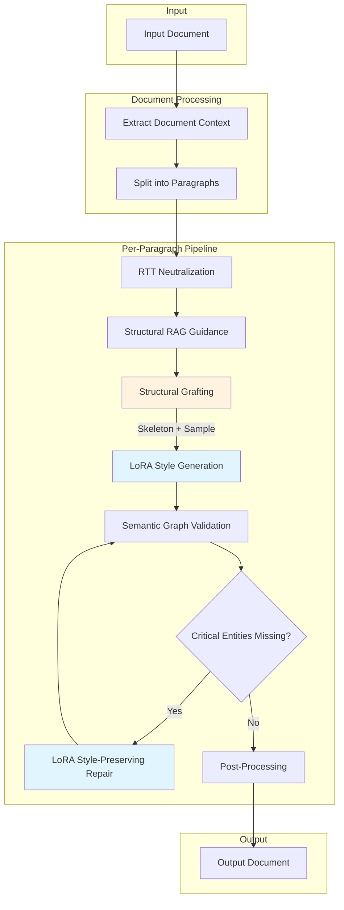

# Text Style Transfer

Transform text to match a target author's writing style while preserving semantic meaning. Uses LoRA-adapted language models for fast, consistent style transfer with semantic graph validation to ensure content fidelity.

## Features

- **LoRA-Based Generation**: Fine-tuned adapters capture author style in model weights
- **RTT Neutralization**: Round-trip translation strips style before restyling
- **Semantic Graph Validation**: Validates content preservation using proposition graphs
- **Structural Grafting**: Copies rhetorical structure (argument flow) from author samples
- **Structural RAG**: Provides rhythm and syntax guidance from author corpus
- **Persona Prompting**: Dense academic prose patterns to evade AI detection
- **Perspective Control**: Transform to first/third person while maintaining style
- **Interactive REPL**: Terminal UI with 5 variations per paragraph
- **Fast Transfer**: ~15-30 seconds per paragraph

## Requirements

- Python 3.9+
- Apple Silicon Mac (for MLX-based training/inference)
- ~8GB RAM for inference, ~50GB for training
- DeepSeek API key (for RTT neutralization and skeleton extraction)

---

## Installation

```bash
# Clone repository
git clone <repository-url>
cd text-style-transfer

# Create virtual environment
python3 -m venv venv
source venv/bin/activate

# Install dependencies
pip install -r requirements.txt

# Download spaCy model
python -m spacy download en_core_web_lg

# Copy config template
cp config.json.sample config.json
# Edit config.json to add your DEEPSEEK_API_KEY
```

---

## Quick Start

```bash
# Transfer text using an existing adapter
python restyle.py input.txt -o output.txt \
    --adapter lora_adapters/lovecraft \
    --author "H.P. Lovecraft"

# Interactive REPL mode (generates 5 variations)
python restyle.py --repl \
    --adapter lora_adapters/lovecraft \
    --author "H.P. Lovecraft"

# List available adapters
python restyle.py --list-adapters

# Skip verification for faster output
python restyle.py input.txt -o output.txt \
    --adapter lora_adapters/lovecraft \
    --no-verify
```

---

## Corpus Management

### Loading a Corpus

Use the unified corpus loading script to clean, analyze, and index author text:

```bash
# Full pipeline: clean, dedupe, extract skeletons, index
python scripts/load_corpus.py \
    --input data/corpus/author.txt \
    --author "Author Name"

# Fast mode (skip skeleton extraction)
python scripts/load_corpus.py \
    --input data/corpus/author.txt \
    --author "Author Name" \
    --skip-skeletons

# Clear existing and reload
python scripts/load_corpus.py \
    --input data/corpus/author.txt \
    --author "Author Name" \
    --clear

# List indexed authors
python scripts/load_corpus.py --list
```

**What it does:**

1. **Quality Filtering**: Removes short paragraphs, encoding artifacts, fragments
2. **Deduplication**: Removes near-duplicate passages using semantic similarity
3. **Style Metrics**: Extracts sentence length, complexity, POS ratios
4. **Embeddings**: Generates vectors for semantic search
5. **Rhetorical Skeletons**: Extracts argument structure via LLM (e.g., `[Observation] → [Paradox] → [Conclusion]`)
6. **ChromaDB Indexing**: Stores everything for retrieval during inference

### Corpus Requirements

| Requirement | Recommendation |
|-------------|----------------|
| **Size** | 50KB-500KB (~0.9M tokens optimal) |
| **Format** | Clean paragraphs separated by blank lines |
| **Content** | Representative prose samples |
| **Remove** | Headers, footnotes, citations |

---

## Interactive REPL Mode

The REPL provides an interactive terminal UI for live style transfer with **5 variations** per input:

```bash
python restyle.py --repl --adapter lora_adapters/lovecraft --author "H.P. Lovecraft"
```

```
───────────────────────────────────────────────────────────────
─────────────── Style Transfer: H.P. Lovecraft ────────────────
───────────────────────────────────────────────────────────────

  Enter a paragraph to transform (press Enter twice to submit)
  Generates 5 variations for comparison
  Commands: /help, /clear, /history, /quit

│ The old house stood at the end of the street.
│

───────────────────────────────────────────────────────────────
  5 Variations Generated:
───────────────────────────────────────────────────────────────

  [1] (23 words)
  ──────────────────────────────────────────────────────────────
  The ancient edifice loomed at the terminus of that forgotten
  thoroughfare, its gambrel roof silhouetted against a gibbous moon.

  [2] (21 words)
  ──────────────────────────────────────────────────────────────
  At the street's neglected end stood the house—ancient, decrepit,
  and possessed of an atmosphere wholly its own.

  ...
───────────────────────────────────────────────────────────────
```

**How it works:**

1. Enter a paragraph (press Enter twice to submit)
2. Text is neutralized via Round-Trip Translation (RTT)
3. LoRA generates 5 variations for comparison
4. Choose the best variation for your document

**REPL Commands:**

| Command | Description |
|---------|-------------|
| `/help` | Show available commands |
| `/clear` | Clear the screen |
| `/history` | Show transformation history |
| `/last` | Show last transformation |
| `/quit` | Exit the REPL |

---

## Training a LoRA Adapter


### Step 1: Load Corpus into ChromaDB

```bash
python scripts/load_corpus.py \
    --input data/corpus/author.txt \
    --author "Author Name"
```

### Step 2: Generate Training Data

Creates training pairs using instruction back-translation. The script neutralizes styled text to create (neutral → styled) pairs:

```bash
python scripts/generate_flat_training.py \
    --corpus data/corpus/author.txt \
    --author "Author Name" \
    --output data/training/author
```

**Options:**

| Option | Default | Description |
|--------|---------|-------------|
| `--min-words` | 150 | Minimum words per chunk |
| `--max-words` | 400 | Maximum words per chunk |
| `--overlap-sentences` | 2 | Sentence overlap between chunks |

**Output:** `data/training/author.jsonl` with training pairs.

### Step 3: Train the LoRA Adapter

```bash
python scripts/train_mlx_lora.py \
    --from-neutralized data/training/author.jsonl \
    --author "Author Name" \
    --train \
    --output lora_adapters/author
```

**Options:**

| Option | Default | Description |
|--------|---------|-------------|
| `--epochs` | 1 | Training epochs (1 often sufficient) |
| `--batch-size` | 1 | Batch size |
| `--learning-rate` | 1e-5 | Learning rate |
| `--rank` | 64 | LoRA rank |
| `--alpha` | 128 | LoRA alpha (typically 2x rank) |
| `--resume` | - | Resume from checkpoint |

**Training time:** ~1-2 hours on Apple Silicon.

### Step 4: Verify Adapter

```bash
python restyle.py --list-adapters
python restyle.py test.txt -o output.txt --adapter lora_adapters/author -v
```

---

## Running Inference

### Basic Usage

```bash
python restyle.py <input> -o <output> --adapter <path> --author <name>
```

### CLI Options

| Option | Default | Description |
|--------|---------|-------------|
| `--adapter PATH` | - | Path to LoRA adapter (required) |
| `--author NAME` | - | Author name (auto-detected from metadata) |
| `--temperature` | 0.4 | Generation temperature |
| `--perspective` | preserve | Output perspective |
| `--no-verify` | false | Skip entailment verification |
| `--repl` | false | Start interactive REPL mode |
| `-v, --verbose` | false | Verbose output |

### Perspective Options

| Value | Description |
|-------|-------------|
| `preserve` | Keep source perspective (default) |
| `first_person_singular` | I, me, my |
| `first_person_plural` | we, us, our |
| `third_person` | he, she, they |
| `author_voice_third_person` | Write AS the author |

```bash
python restyle.py input.txt -o output.txt \
    --adapter lora_adapters/sagan \
    --perspective first_person_singular
```

---

## Architecture

### Inference Pipeline



**Key Components:**

- **RTT Neutralization**: Strips source style via English → Mandarin → English translation
- **Structural RAG**: Retrieves rhythm patterns (sentence length distribution, complexity) from corpus
- **Structural Grafting**: Finds semantically similar passage, extracts its rhetorical skeleton, injects as blueprint
- **Semantic Graph Validation**: Only named entities trigger repair; vocabulary changes are accepted
- **Post-Processing**: Grammar correction, sentence splitting, repetition reduction

### Structural Grafting

Copies the **argumentative structure** from author samples without copying words:

```
Input: "The scientific method begins with observation..."

Retrieved Sample: "The cosmos, in its infinite expanse, presents to the
inquiring mind a tapestry of phenomena..."

Extracted Skeleton: [Observation] → [Paradox] → [Rhetorical Question] → [Resolution]

Output: "The methodology of science—that most rigorous of human
endeavors—commences with observation. Yet how curious that mere
observation should yield such profound truths? The answer lies..."
```

---

## Project Structure

```
text-style-transfer/
├── restyle.py                    # Main CLI entry point
├── config.json                   # Configuration file
├── requirements.txt              # Python dependencies
│
├── src/                          # Source code
│   ├── generation/               # Style transfer pipeline
│   │   ├── transfer.py          # Main StyleTransfer class
│   │   ├── lora_generator.py    # MLX LoRA inference
│   │   └── document_context.py  # Document-level context
│   │
│   ├── validation/               # Content preservation
│   │   ├── semantic_graph.py    # Proposition graph analysis
│   │   └── entailment.py        # NLI entailment checking
│   │
│   ├── rag/                      # Structural RAG system
│   │   ├── style_analyzer.py    # spaCy style metrics
│   │   ├── corpus_indexer.py    # ChromaDB indexing
│   │   ├── structural_analyzer.py # Rhythm pattern analysis
│   │   ├── structural_rag.py    # Rhythm/syntax guidance
│   │   ├── skeleton_extractor.py # Rhetorical skeleton extraction
│   │   ├── structural_grafter.py # Skeleton-based grafting
│   │   └── enhanced_analyzer.py # Vocabulary/transition analysis
│   │
│   ├── persona/                  # AI detection evasion
│   │   ├── config.py            # Per-author persona settings
│   │   └── prompt_builder.py    # Dense academic prompts
│   │
│   ├── llm/                      # LLM providers
│   │   ├── provider.py          # Base provider interface
│   │   ├── mlx_provider.py      # MLX (local Apple Silicon)
│   │   └── deepseek.py          # DeepSeek API
│   │
│   ├── vocabulary/               # Post-processing
│   │   ├── repetition_reducer.py # LLM-speak reduction
│   │   ├── sentence_splitter.py # Run-on sentence splitting
│   │   └── grammar_checker.py   # Style-safe grammar fixes
│   │
│   ├── repl/                     # Interactive REPL
│   │   └── repl.py              # Terminal UI (5 variations)
│   │
│   └── utils/                    # Utilities
│       ├── nlp.py               # spaCy utilities
│       └── logging.py           # Logging
│
├── scripts/                      # Training & data scripts
│   ├── load_corpus.py           # Unified corpus loading
│   ├── generate_flat_training.py # Generate training data via RTT
│   ├── train_mlx_lora.py        # Train LoRA adapter
│   ├── curate_corpus.py         # Filter corpus to optimal size
│   └── update_skeletons.py      # Add skeletons to existing index
│
├── prompts/                      # Prompt templates
│   └── style_transfer.txt       # Main generation prompt
│
├── data/
│   ├── corpus/                   # Author corpus files
│   ├── training/                 # Generated training data
│   └── rag_index/                # ChromaDB persistent index
│
└── lora_adapters/                # Trained LoRA adapters
    └── <author>/
        ├── adapters.safetensors # LoRA weights
        ├── adapter_config.json  # LoRA config
        └── metadata.json        # Training metadata
```

---

## Configuration

Key settings in `config.json`:

```json
{
  "llm": {
    "provider": {
      "writer": "mlx",
      "critic": "deepseek",
      "rtt": "deepseek"
    }
  },
  "generation": {
    "entailment_threshold": 0.9,
    "max_repair_attempts": 3,
    "max_expansion_ratio": 2.5,
    "target_expansion_ratio": 1.0,
    "lora_scale": 0.3,
    "skip_neutralization": false,
    "reduce_repetition": true,
    "use_structural_rag": true,
    "use_structural_grafting": true,
    "use_persona": true,
    "correct_grammar": true,
    "split_sentences": true
  }
}
```

### Key Options

| Option | Default | Description |
|--------|---------|-------------|
| `lora_scale` | 0.3 | LoRA influence (0.0=base only, 1.0=full, >1.5 risks memorization) |
| `use_structural_rag` | true | Enable rhythm/syntax guidance from corpus |
| `use_structural_grafting` | true | Enable rhetorical skeleton grafting |
| `use_persona` | true | Enable dense academic persona prompts |
| `skip_neutralization` | false | Skip RTT (use original text directly) |
| `correct_grammar` | true | Apply style-safe grammar corrections |
| `split_sentences` | true | Break run-on sentences at conjunctions |

---

## Troubleshooting

### Content Being Lost

- Increase `entailment_threshold` to 0.9
- Check for missing named entities in verbose output (`-v`)
- Lower `lora_scale` if model is hallucinating

### Style Too Weak

- Increase `lora_scale` to 0.5-1.0
- Ensure corpus is indexed: `python scripts/load_corpus.py --list`

### Memorized Output (No Content Overlap)

- Lower `lora_scale` to 0.2-0.3
- Use earlier training checkpoint

### MLX Not Available

Requires Apple Silicon. For other platforms, use Ollama provider.

### Out of Memory

Use 4-bit model in config.json:
```json
"mlx": { "model": "mlx-community/Qwen3-8B-4bit" }
```

### Missing API Key

```bash
export DEEPSEEK_API_KEY="your-key"
```

---

## Performance

| Metric | Value |
|--------|-------|
| Per-paragraph | 15-30 seconds |
| Memory (inference) | ~8GB |
| Memory (training) | ~50GB |
| Training time | ~1-2 hours |
| Corpus indexing | ~2s/chunk (with skeletons) |

---

## License

MIT License - See LICENSE file for details.
