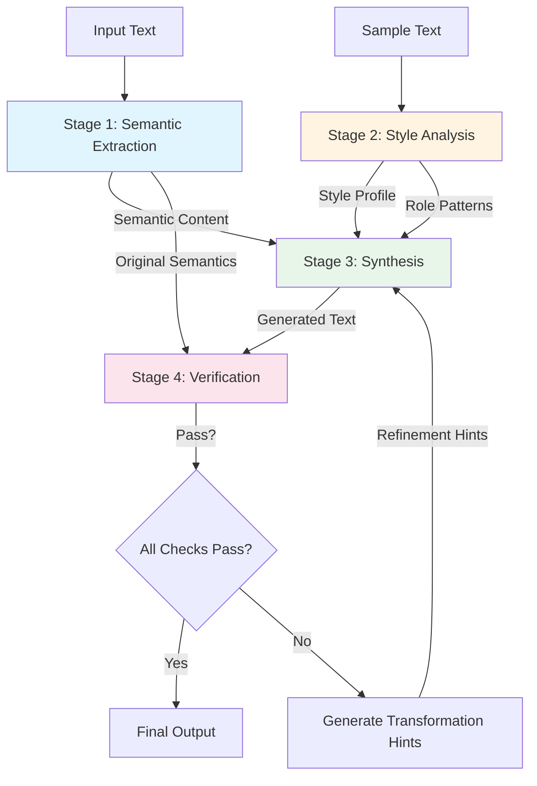
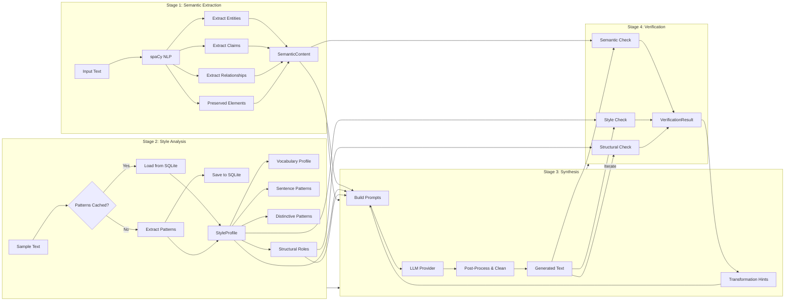
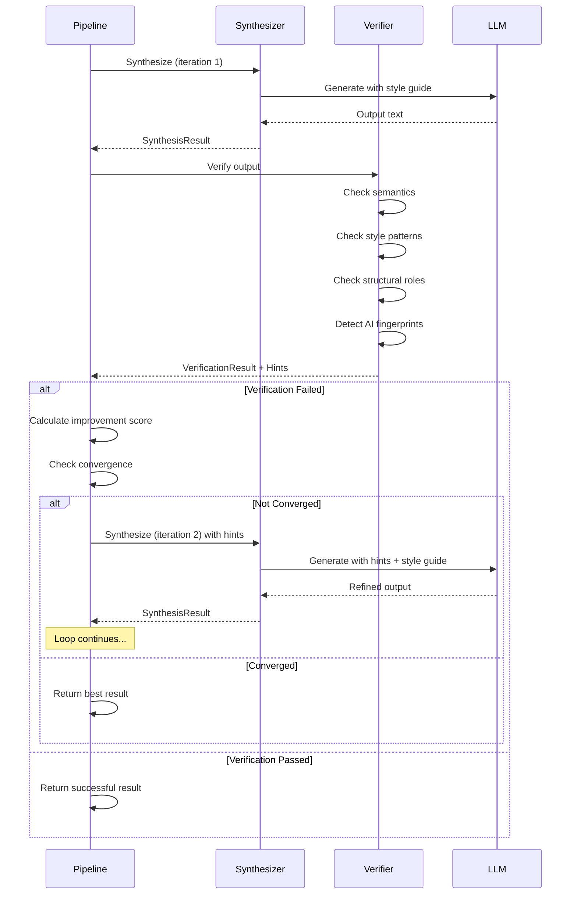
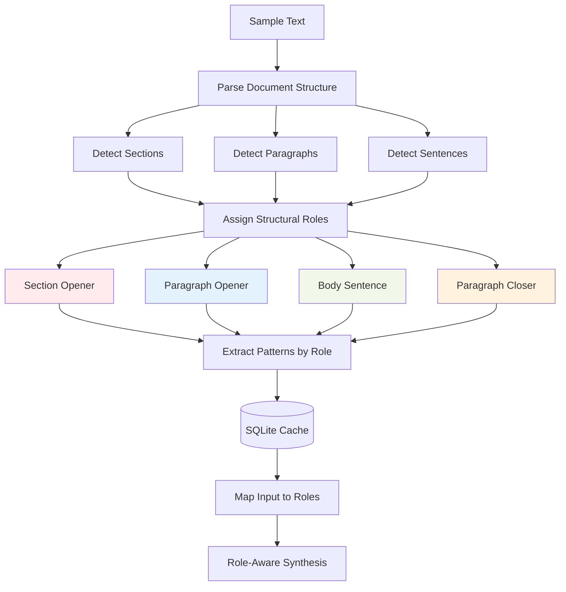

# AI Text Depattern - Style Transfer Pipeline

A Python tool that rewrites AI-generated text to match a target writing style while preserving all original meaning. Uses Few-Shot Style Transfer with iterative refinement to eliminate AI fingerprints and adopt distinctive stylistic patterns.

## Overview

This tool implements a 4-stage pipeline that:
1. **Extracts semantic content** (facts, claims, relationships) from input text
2. **Analyzes target style** from a sample text (vocabulary, sentence patterns, structural roles)
3. **Synthesizes new text** using LLM to express the extracted meaning in the target style
4. **Verifies and refines** iteratively using transformation hints until quality thresholds are met

The system uses a genetic algorithm approach with convergence detection, automatically refining output until it matches the target style while preserving semantic content.

## Architecture

### High-Level Pipeline



### Detailed Stage Flow



### Iterative Refinement Loop



### Structural Role Analysis



## Installation

### Prerequisites

- Python 3.8 or higher
- pip (Python package manager)

### Setup

1. **Clone the repository** (or navigate to the project directory):
   ```bash
   cd ai-text-depattern
   ```

2. **Create a virtual environment**:
   ```bash
   python3 -m venv venv
   ```

3. **Activate the virtual environment**:

   On macOS/Linux:
   ```bash
   source venv/bin/activate
   ```

   On Windows:
   ```bash
   venv\Scripts\activate
   ```

4. **Install dependencies**:
   ```bash
   pip install -r requirements.txt
   ```

5. **Download spaCy language model**:
   ```bash
   python -m spacy download en_core_web_sm
   ```

6. **Configure API keys** (if using DeepSeek or GLM):

   Edit `config.json` and add your API keys, or set environment variables:
   ```bash
   export DEEPSEEK_API_KEY=your-api-key-here
   export GLM_API_KEY=your-api-key-here
   ```

## Usage

### Basic Usage

Transform a single file:
```bash
python humanizer.py input/document.md
```

Output will be written to `output/document.md` by default.

### Command-Line Options

```bash
python humanizer.py [OPTIONS] input_file
```

**Options:**
- `-o, --output PATH` - Specify output file path
- `-c, --config PATH` - Use custom config file (default: `config.json`)
- `-r, --retries N` - Maximum refinement iterations (overrides config.json, default: from config or 10)
- `-v, --verbose` - Show detailed progress and metrics
- `--chunked` - Process document paragraph by paragraph (for long documents)
- `--analyze-only` - Only analyze input, don't transform
- `--json` - Output results as JSON

### Examples

**Basic transformation:**
```bash
python humanizer.py input/small.md
```

**Custom output path with verbose output:**
```bash
python humanizer.py input/small.md -o output/transformed.md --verbose
```

**Long document with paragraph-by-paragraph processing:**
```bash
python humanizer.py input/long-document.md --chunked -r 10
```

**Maximum refinement iterations:**
```bash
python humanizer.py input/small.md -r 10 --verbose
```

## Configuration

Configuration is managed through `config.json`. The file contains settings for LLM providers and verification thresholds.

### Provider Configuration

Choose your LLM provider by setting the `provider` field:

```json
{
  "provider": "deepseek"  // Options: "deepseek", "glm", "ollama"
}
```

#### DeepSeek Configuration

```json
{
  "deepseek": {
    "api_key": "your-api-key-here",
    "api_url": "https://api.deepseek.com/v1/chat/completions",
    "editor_model": "deepseek-chat",
    "critic_model": "deepseek-chat"
  }
}
```

**API Key:** Set `api_key` in config.json or use environment variable:
```bash
export DEEPSEEK_API_KEY=your-api-key-here
```

#### GLM (Z.AI) Configuration

```json
{
  "glm": {
    "api_key": "your-api-key-here",
    "api_url": "https://api.z.ai/api/paas/v4/chat/completions",
    "editor_model": "glm-4.6",
    "critic_model": "glm-4.6"
  }
}
```

**API Key:** Set `api_key` in config.json or use environment variable:
```bash
export GLM_API_KEY=your-api-key-here
```

#### Ollama (Local) Configuration

For local models via Ollama:

```json
{
  "ollama": {
    "url": "http://localhost:11434/api/generate",
    "editor_model": "qwen3:32b",
    "critic_model": "deepseek-r1:8b"
  }
}
```

**Setup:**
1. Install [Ollama](https://ollama.ai/)
2. Pull required models:
   ```bash
   ollama pull qwen3:32b
   ollama pull deepseek-r1:8b
   ```
3. Start Ollama server:
   ```bash
   ollama serve
   ```

### Verification Thresholds

Control the balance between style fidelity and semantic preservation:

```json
{
  "verification": {
    "max_meaning_drift": 0.70,      // Maximum allowed semantic drift (0.0-1.0)
    "min_claim_coverage": 0.80,    // Minimum percentage of claims preserved
    "min_style_match": 0.60,        // Minimum style match score
    "min_structural_match": 0.40    // Minimum structural pattern match
  }
}
```

#### Threshold Tuning Guide

| Setting | Lower Value | Higher Value | Use Case |
|---------|-------------|--------------|----------|
| `max_meaning_drift` | Stricter semantic preservation (0.40) | More aggressive style transfer (0.80) | Lower for technical docs, higher for creative rewriting |
| `min_claim_coverage` | More lenient (0.70) | Stricter (0.95) | Higher for factual content, lower for summaries |
| `min_style_match` | More lenient (0.50) | Stricter (0.75) | Higher for strict style requirements |
| `min_structural_match` | More lenient (0.30) | Stricter (0.60) | Higher for matching specific structural patterns |

**Example Configurations:**

**Conservative (preserve meaning):**
```json
{
  "verification": {
    "max_meaning_drift": 0.40,
    "min_claim_coverage": 0.90,
    "min_style_match": 0.50,
    "min_structural_match": 0.30
  }
}
```

**Aggressive (strong style transfer):**
```json
{
  "verification": {
    "max_meaning_drift": 0.80,
    "min_claim_coverage": 0.75,
    "min_style_match": 0.70,
    "min_structural_match": 0.50
  }
}
```

### Pipeline Configuration

Control the iterative refinement behavior:

```json
{
  "pipeline": {
    "max_retries": 10,              // Maximum refinement iterations
    "convergence_threshold": 0.02,  // Stop when improvement < 2%
    "min_iterations": 2             // Always do at least 2 iterations
  }
}
```

#### Pipeline Settings

| Setting | Default | Description |
|---------|---------|-------------|
| `max_retries` | 10 | Maximum number of refinement iterations. Higher values allow more refinement but take longer. Recommended: 8-10 for quality, 3-5 for speed. |
| `convergence_threshold` | 0.02 | Stop iterating when improvement between iterations is less than this percentage (2%). Lower = more iterations, higher = stops sooner. |
| `min_iterations` | 2 | Always perform at least this many iterations, even if convergence is detected early. |
| `auto_chunk_threshold` | 2000 | Token count threshold for automatic chunked mode. Documents exceeding this are processed paragraph-by-paragraph to prevent truncation. |

**Note:** The `-r, --retries` command-line argument overrides `max_retries` from config.json if provided.

**Auto-Chunking:** Long documents are automatically processed paragraph-by-paragraph when they exceed `auto_chunk_threshold` tokens. This prevents LLM output truncation and ensures the entire document is fully restyled. Truncation is also detected and recovered automatically.

**Example Configurations:**

**Fast (fewer iterations):**
```json
{
  "pipeline": {
    "max_retries": 5,
    "convergence_threshold": 0.03,
    "min_iterations": 2
  }
}
```

**Thorough (more iterations):**
```json
{
  "pipeline": {
    "max_retries": 15,
    "convergence_threshold": 0.01,
    "min_iterations": 3
  }
}
```

### Example Selection Configuration

Control how few-shot examples are selected from the sample text for each paragraph being transformed:

```json
{
  "example_selection": {
    "num_examples": 3,         // Number of examples to include in prompts
    "semantic_weight": 0.4,    // Weight for semantic similarity (0.0-1.0)
    "structural_weight": 0.6,  // Weight for structural similarity (0.0-1.0)
    "min_word_count": 30,      // Minimum paragraph length to consider
    "max_word_count": 300      // Maximum paragraph length to consider
  }
}
```

#### Example Selection Settings

| Setting | Default | Description |
|---------|---------|-------------|
| `num_examples` | 3 | Number of example paragraphs to include in synthesis prompts. More examples provide stronger style guidance but use more tokens. |
| `semantic_weight` | 0.4 | Weight given to semantic (meaning) similarity when selecting examples. Higher values prefer examples with similar topics. |
| `structural_weight` | 0.6 | Weight given to structural similarity (sentence count, length, opener type). Higher values prefer examples with matching structure. |
| `min_word_count` | 30 | Minimum word count for a sample paragraph to be considered as an example. |
| `max_word_count` | 300 | Maximum word count for a sample paragraph to be considered as an example. |

**How It Works:**

Instead of using the same 3 paragraphs for every transformation, the system:
1. Analyzes all qualifying paragraphs in `sample.txt`
2. Computes semantic embeddings using sentence-transformers (cached in SQLite)
3. Extracts structural features (sentence count, opener type, structural role)
4. For each input paragraph, selects the most similar examples using weighted similarity
5. Uses diverse selection to avoid redundant examples

**Example Configurations:**

**Semantic-focused (topic matching):**
```json
{
  "example_selection": {
    "num_examples": 4,
    "semantic_weight": 0.7,
    "structural_weight": 0.3
  }
}
```

**Structure-focused (form matching):**
```json
{
  "example_selection": {
    "num_examples": 3,
    "semantic_weight": 0.2,
    "structural_weight": 0.8
  }
}
```

## Project Structure

```
ai-text-depattern/
├── humanizer.py              # Main pipeline orchestrator
├── semantic_extractor.py     # Stage 1: Extract meaning from input
├── style_analyzer.py         # Stage 2: Analyze target style
├── synthesizer.py            # Stage 3: Generate text in target style
├── verifier.py               # Stage 4: Verify and generate hints
├── structural_analyzer.py    # Structural role analysis and pattern extraction
├── example_selector.py       # Contextual example selection for few-shot prompts
├── ai_word_replacer.py       # AI fingerprint detection and contextual replacement
├── config.json               # Configuration file
├── requirements.txt          # Python dependencies
├── prompts/
│   └── sample.txt            # Target style sample (Stalin's Dialectical Materialism)
├── input/                    # Input files directory
├── output/                   # Output files directory
├── structural_cache.db       # SQLite cache for structural patterns (auto-generated)
└── README.md                 # This file
```

## How It Works

### Stage 1: Semantic Extraction

Uses spaCy NLP to extract:
- **Entities**: Named entities, proper nouns, technical terms
- **Claims**: Factual statements and assertions
- **Relationships**: Logical connections between concepts
- **Preserved Elements**: Citations, numbers, quotes, technical terms

### Stage 2: Style Analysis

Analyzes the sample text (`prompts/sample.txt`) to extract:
- **Vocabulary Profile**: Word frequency, formality, transition words
- **Sentence Patterns**: Length distribution, opener types, structure
- **Distinctive Patterns**:
  - Phrasal patterns (e.g., "Contrary to...", "Hence,...")
  - Syntactic constructions (e.g., "The X method therefore holds that...")
  - Discourse markers and their positions
- **Structural Roles**: Patterns by position (section opener, paragraph opener, etc.)

Patterns are cached in SQLite for performance.

### Stage 3: Synthesis

LLM generates new text using:
- Extracted semantic content (what to say)
- Style profile (how to say it)
- Structural role guidance (where to use which patterns)
- Transformation hints from previous iterations (what to fix)

Post-processing removes AI fingerprints and applies pattern replacements.

### Stage 4: Verification

Validates output across three dimensions:

1. **Semantic Verification**:
   - Claim coverage (are all facts preserved?)
   - Meaning drift (has the meaning changed?)

2. **Style Verification**:
   - Sentence length match
   - Pattern coverage (are distinctive patterns used?)
   - Discourse marker usage
   - Formality match
   - AI fingerprint detection

3. **Structural Verification**:
   - Role-appropriate patterns
   - Position-based pattern usage

If verification fails, generates specific `TransformationHint` objects that tell the synthesizer exactly what to fix.

### Iterative Refinement

The pipeline uses a genetic algorithm approach:

1. Generate initial output
2. Verify and score
3. Generate transformation hints
4. Re-synthesize with hints
5. Track improvement score
6. Stop when:
   - All checks pass, OR
   - Convergence detected (improvement < 2%), OR
   - Max iterations reached

## Key Features

- ✅ **Dynamic Pattern Extraction**: Patterns extracted from sample text at runtime (no hardcoding)
- ✅ **SQLite Caching**: Structural patterns cached for fast subsequent runs
- ✅ **Context-Aware Synthesis**: Each sentence considers its structural role (section opener, paragraph opener, etc.)
- ✅ **Contextual Example Selection**: Few-shot examples selected based on semantic and structural similarity to input
- ✅ **AI Fingerprint Detection**: Automatically detects and removes AI-typical phrases with contextual replacements from sample vocabulary
- ✅ **Iterative Refinement**: Genetic algorithm approach with convergence detection
- ✅ **Configurable Thresholds**: Balance style fidelity vs semantic preservation
- ✅ **Multiple LLM Providers**: DeepSeek, GLM (Z.AI), or Ollama (local)

## Troubleshooting

### "Module not found" errors

Make sure the virtual environment is activated:
```bash
source venv/bin/activate  # macOS/Linux
venv\Scripts\activate     # Windows
```

### API key errors

Check that your API key is set in `config.json` or as an environment variable:
```bash
echo $DEEPSEEK_API_KEY  # Check if set
```

### Low quality output

- Increase `--retries` (e.g., `-r 10`) for more refinement iterations
- Adjust `max_meaning_drift` in config.json (higher = more aggressive style transfer)
- Check that `prompts/sample.txt` contains sufficient style examples

### Slow performance

- Structural patterns are cached after first run
- Use `--chunked` for very long documents
- Consider using local Ollama models to avoid API rate limits

## License

[Add your license here]

## Contributing

[Add contribution guidelines here]

