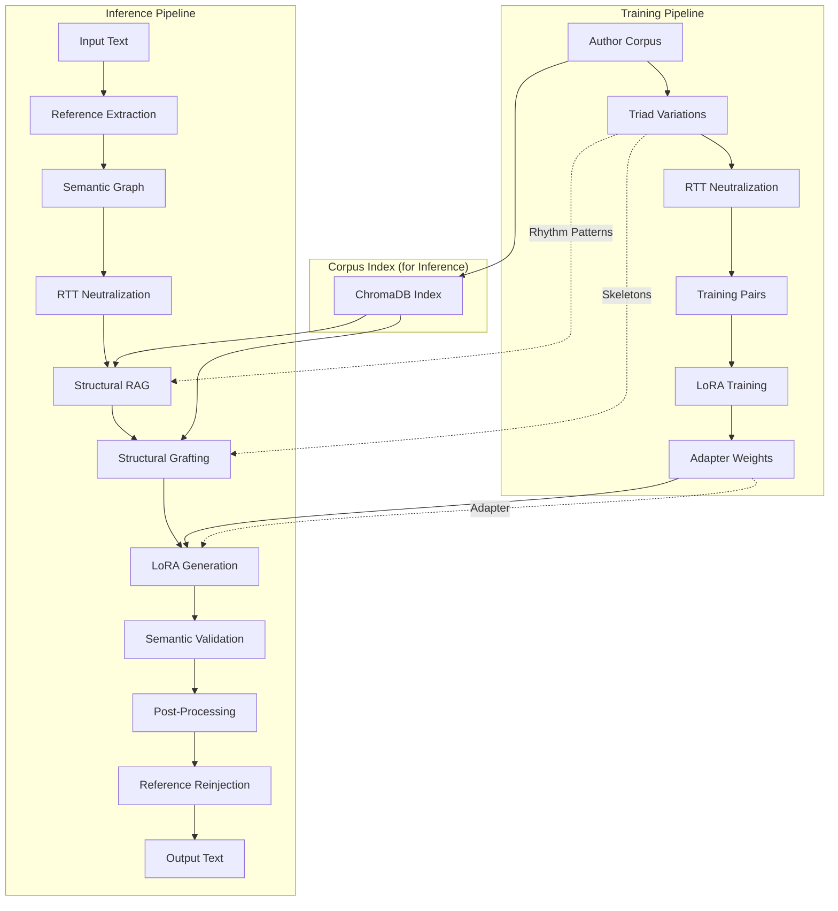
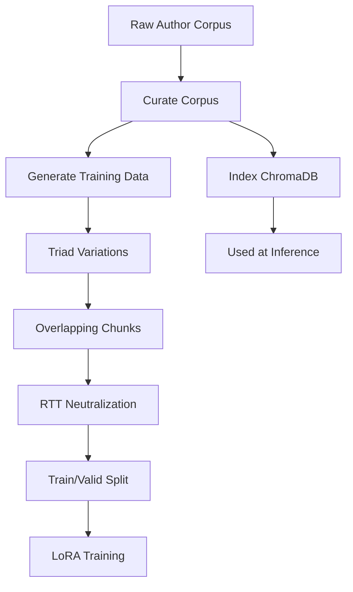
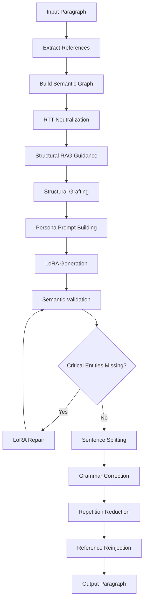

# Architecture: Style Transfer via LoRA Fine-Tuning

This document provides a deep technical explanation of the style transfer system, covering both training and inference pipelines in sufficient detail for reproducibility.

---

## System Overview



---

## Part 1: LoRA Training

### Overview

The goal is to train a LoRA adapter that captures an author's writing style such that:
- Given **neutral prose** describing some content
- The model outputs **styled prose** in the author's voice

The key insight is that training data format is critical. Using `(neutral → styled)` pairs teaches the model to **transform** rather than **memorize**.

### Why Round-Trip Translation (RTT)?

Style transfer requires teaching the model what "style" means separate from "content". The challenge: how do you create neutral versions of styled text without losing information?

**Failed approaches:**
1. **Summarization** - Loses facts, teaches compression not style
2. **OpenIE triples** - "Subject-Verb-Object" extraction is lossy
3. **Manual rewriting** - Doesn't scale, inconsistent

**Solution: Round-Trip Translation via Mandarin**

RTT exploits linguistic distance to strip style while preserving facts:

```
Styled English → Mandarin (HSK5) → Neutral English
```

**Why Mandarin works:**

1. **Grammar distance**: Mandarin's Topic-Prominent structure can't support nested English clauses. Complex syntax flattens automatically.

2. **No cognates**: Unlike French/Spanish, Mandarin shares no vocabulary roots with English. Literary words like "cyclopean" become 巨大的 (huge) → "huge" in translation.

3. **HSK5 vocabulary constraint**: Limiting to ~5000 common words strips archaic/literary vocabulary.

4. **Natural output**: Unlike graph-based extraction, RTT produces fluent neutral prose that serves as good training input.

**Example:**

```
Styled (Lovecraft):
"The cyclopean masonry of that blasphemous edifice spoke of
 eons predating mankind's feeble scratching upon this globe."

After RTT:
"The huge stone building was very old. It was built long
 before humans lived on Earth."
```

All facts preserved. All style stripped.

### Corpus Requirements

**Optimal size: 600K-900K tokens (~150KB-300KB raw text)**

| Size | Effect |
|------|--------|
| < 300K tokens | Underfitting - style not captured |
| 600K-900K tokens | Optimal - style captured, no memorization |
| > 1.5M tokens | Diminishing returns, longer training |

**Quality criteria for paragraphs:**

```python
min_words: 30         # Skip fragments
max_words: 650        # Avoid very long passages
min_sentences: 2      # Need multiple sentences for rhythm
max_special_char_ratio: 0.10  # Avoid code/tables
max_word_repetition_ratio: 0.55  # Avoid repetitive text
```

### Training Pipeline



#### Step 1: Curate Corpus (Recommended)

If your raw corpus is large or noisy, curate it to optimal size:

```bash
python scripts/curate_corpus.py \
    --input data/corpus/author_raw.txt \
    --output data/corpus/curated/author.txt \
    --target-tokens 900000
```

**What curation does:**
- Filters low-quality paragraphs (short, OCR artifacts, fragments)
- Selects diverse passages using embedding clustering
- Caps output at target token budget (~900K tokens optimal)

**Skip curation if:** corpus is already clean and <500KB.

#### Step 2: Generate Training Data

```bash
python scripts/generate_flat_training.py \
    --corpus data/corpus/curated/author.txt \
    --author "Author Name" \
    --output data/training/author
```

**Pipeline stages:**

**Stage 1: Extract Quality Paragraphs**

Filter corpus for high-quality paragraphs (min words, proper sentences, no encoding artifacts).

**Stage 2: Triad Strategy (Variation Generation)**

For each original paragraph, create a 1:3 expansion:

| Entry | Type | Purpose |
|-------|------|---------|
| 1 | **Anchor** | Original author text |
| 2 | **Snowflake** | LLM-generated topic variation (same structure, mundane topic like "folding laundry") |
| 3 | **Robustness** | Original text marked for heavy input perturbation |

**Critical:** Snowflakes are **styled text first**. The LLM creates a passage in the author's voice about a mundane topic, preserving the exact sentence structure. This styled snowflake is then neutralized in Stage 4.

Training pairs:
- Anchors: `neutral(original) → styled(original)` — learns vocabulary
- Snowflakes: `neutral(snowflake) → styled(snowflake)` — learns structure

Since snowflakes are about unrelated topics, the model learns the **transformation function** rather than content patterns.

**Stage 3: Overlapping Chunks (Style Lives in Transitions)**

Research shows stylistic markers concentrate at sentence boundaries. Create overlapping chunks:

```
Config:
  min_words: 150
  max_words: 400
  overlap_sentences: 2
```

A corpus of 100 paragraphs × 3 (triad) might yield 600+ overlapping chunks.

**Stage 4: RTT Neutralization**

Each chunk goes through the RTT pipeline:

```
Prompt (rtt_deepseek.txt):
  STEP 1 - Translate to simple Mandarin (HSK 5 vocabulary)
  STEP 2 - Translate back to plain English (SVO structure)

  CRITICAL: Output MUST be AT LEAST as long as input
  EVERY fact, figure, date, name MUST appear in output
```

Uses DeepSeek API for speed (batch_size=10, concurrent_batches=4).

**Stage 5: Format Training Pairs**

Final format for base model training (text completion):

```json
{
  "text": "Write a {word_count} word excerpt about the content below emulating the style and voice of {author}\n\n{neutralized_text}\n\n{original_styled_text}"
}
```

The style tag provides structural hints:
```
[STYLE: Varied Lengths | Complex Syntax | Em-Dashes]
```

#### Step 3: Index Corpus in ChromaDB (for Inference)

Index the curated corpus for retrieval **during inference** (not training):

```bash
python scripts/load_corpus.py \
    --input data/corpus/curated/author.txt \
    --author "Author Name"
```

**What this creates:**
- Paragraph embeddings for semantic search
- Style metrics per paragraph (sentence length, complexity, POS ratios)
- Rhetorical skeletons (argument structure like `[Observation] → [Analysis] → [Conclusion]`)

The ChromaDB index is stored at `data/rag_index/` and used during inference for:
- **Structural RAG**: Retrieving rhythm patterns
- **Structural Grafting**: Finding similar passages and copying their argument structure

#### Step 4: Train LoRA Adapter

Create a config.yaml file for training:

```yaml
# data/training/author/config.yaml
model: "./models/Qwen2.5-14B-Base-4bit-MLX"  # Local 4-bit model
train: true
data: "data/training/author"

batch_size: 1
grad_accumulation: 4     # Effective batch = 4
grad_checkpoint: true    # Required for 14B+ models
iters: 2100              # ~0.6 epochs (prevents overfitting)
learning_rate: 1e-5
num_layers: -1           # All layers (-1) or 16 if memory constrained

lora_parameters:
  rank: 64               # High rank for syntactic patterns
  scale: 2.0             # Strong style override
  dropout: 0.1           # Forces structural learning over memorization
  keys:
    - "self_attn.q_proj"
    - "self_attn.k_proj"
    - "self_attn.v_proj"
    - "self_attn.o_proj"
    - "mlp.gate_proj"
    - "mlp.up_proj"
    - "mlp.down_proj"

adapter_path: "lora_adapters/author"
save_every: 200          # Save checkpoints frequently
steps_per_report: 10
steps_per_eval: 200
seed: 42
```

Run training:
```bash
mlx_lm.lora --config data/training/author/config.yaml
```

**Key hyperparameters:**

| Parameter | Recommended | Notes |
|-----------|-------------|-------|
| `rank` | 64 | Higher = more capacity for complex syntax |
| `scale` | 2.0 | Strong style signal (alpha/rank ratio) |
| `dropout` | 0.1 | Prevents keyword memorization |
| `learning_rate` | 1e-5 | Lower for style (not factual) learning |
| `iters` | ~0.6-0.9 epochs | Prevents overfitting |
| `batch_size` | 1 | Small batches learn individual quirks |
| `num_layers` | -1 or 16 | All layers or last 16 if memory constrained |

**Base model selection:**

| Model | Training Memory | Inference Memory | Quality |
|-------|-----------------|------------------|---------|
| `Qwen2.5-7B-Base-4bit` | ~20GB | ~8GB | Good |
| **`Qwen2.5-14B-Base-4bit`** | ~40GB | ~16GB | **Recommended** |
| `Qwen2.5-32B-Base-4bit` | ~64GB+ | ~24GB | Highest |

Training produces:
```
lora_adapters/author/
├── adapters.safetensors       # Final LoRA weights
├── 0000200_adapters.safetensors  # Checkpoints
├── adapter_config.json        # LoRA config (auto-generated)
└── metadata.json              # **Required** - create manually
```

**Create metadata.json (required for inference):**

```json
{
    "author": "Author Name",
    "base_model": "./models/Qwen2.5-14B-Base-4bit-MLX",
    "lora_rank": 64,
    "lora_alpha": 128,
    "training_examples": 3770
}
```

This file tells the inference pipeline which base model to load.

### Validation During Training

Monitor validation loss. If it starts increasing while training loss decreases → overfitting.

**Signs of good training:**
- Validation loss decreases then stabilizes
- Generated samples show style variation (not exact memorization)
- Different inputs produce different outputs with same style

**Signs of problems:**
- Validation loss increases → reduce epochs or learning rate
- Output matches training examples verbatim → reduce rank or epochs
- Output ignores input content → increase training data diversity

---

## Part 2: Inference Pipeline

### Overview



### Step 0: Extract References

Before any transformation, extract footnote references `[^N]` and inline citations `[N]` so they can be reinjected after styling:

```python
from src.validation.reference_tracker import extract_references, reinject_references

paragraph_clean, ref_map = extract_references(paragraph)
# ref_map tracks: marker -> attached_word -> context
```

References are stripped during processing (RTT and LoRA don't handle them well) and reinjected at the end based on entity matching.

### Step 1: Build Source Semantic Graph

Extract the "ground truth" from the source:

```python
builder = SemanticGraphBuilder(use_rebel=False)
source_graph = builder.build_from_text(paragraph_clean)
```

The graph contains:
- **Proposition nodes**: Subject-Predicate-Object triples
- **Entity nodes**: Named entities (people, places, dates, numbers)
- **Relationships**: Logical connections between propositions

This graph is used later to verify the output preserves all facts.

### Step 2: RTT Neutralization

**Why neutralize during inference?**

The LoRA was trained on `(neutral → styled)` pairs. If you feed it styled text, it might:
- Get confused by existing style markers
- Try to "double-style" the input
- Produce inconsistent results

By RTT-neutralizing first, we match the training distribution.

```python
# From transfer.py
if self.config.skip_neutralization:
    content_for_generation = paragraph_clean
else:
    content_for_generation = self._rtt_neutralize(paragraph_clean)
```

**RTT Configuration:**
```json
"deepseek_rtt": {
  "model": "deepseek-chat",
  "temperature": 0.1,    // Low for consistency
  "batch_size": 10,
  "concurrent_batches": 4
}
```

### Step 3: Structural RAG Guidance

Retrieve rhythm patterns from the author's corpus (indexed in ChromaDB):

```python
if self.structural_rag:
    guidance = self.structural_rag.get_guidance(paragraph)
    structural_guidance = guidance.format_for_prompt()
```

**What Structural RAG provides:**

```
STRUCTURAL GUIDANCE:
Rhythm patterns from author's corpus:
- Vary sentence length: 5, 23, 8, 31, 12 words
- Use punctuation: semicolons (;), em-dashes (—)
- Start some sentences with conjunctions: "And", "But", "Yet"
```

This gives the model concrete structural targets beyond just "write like X".

### Step 4: Structural Grafting

Find a semantically similar passage in the corpus and extract its rhetorical skeleton:

```python
if self.structural_grafter:
    grafting_guidance = self.structural_grafter.get_grafting_guidance(paragraph)
    # Returns: skeleton + source sample
```

**Example:**

```
Input: "The scientific method begins with observation..."

Retrieved Sample: "The cosmos, in its infinite expanse, presents to the
inquiring mind a tapestry of phenomena..."

Extracted Skeleton: [Observation] → [Paradox] → [Rhetorical Question] → [Resolution]
```

The skeleton provides an argumentative blueprint without copying any words from the source.

### Step 5: Persona Prompt Building

Build a persona-injected prompt that captures the author's voice characteristics:

```python
if self.config.use_persona and PERSONA_AVAILABLE:
    persona = get_persona_config(self.author)
    final_content = build_persona_prompt(
        content=content_for_generation,
        author=self.author,
        persona=persona,
        vocabulary_palette=persona.adjective_themes[:10],
        structural_guidance=structural_guidance,
        grafting_guidance=grafting_guidance,
    )
```

**Persona elements:**
- **Archetype**: Dense academic prose, clinical detachment
- **Vocabulary palette**: Preferred adjectives and nouns
- **Syntactic patterns**: Em-dashes, nominalization, which-clauses
- **Anti-patterns**: Words to avoid (furthermore, moreover, etc.)

### Step 6: LoRA Generation

The core style transfer:

```python
output = self.generator.generate(
    content=final_content,
    author=self.author,
    max_tokens=max_tokens,
    target_words=target_words,
    structural_guidance=structural_guidance,
    raw_prompt=use_raw_prompt,  # True if persona prompt used
)
```

**Key parameters:**

```json
"mlx": {
  "temperature": 0.2,      // Low for consistency
  "top_p": 0.9,
  "max_tokens": 256
}
```

**lora_scale setting:**

| Value | Effect |
|-------|--------|
| 0.0 | Base model only (no style) |
| 0.3 | Subtle style (recommended for most cases) |
| 0.5-1.0 | Strong style |
| >1.5 | Risk of memorization |

### Step 7: Semantic Validation

Compare output graph to source graph:

```python
output_graph = builder.build_from_text(output)
diff = comparator.compare(source_graph, output_graph)

if diff.missing_nodes:
    missing_entities = self._extract_critical_entities(diff.missing_nodes)
```

**What triggers repair:**

| Condition | Action |
|-----------|--------|
| No differences | Accept output |
| Missing propositions, no entities | Accept (vocabulary changes OK) |
| Missing named entities | Trigger LoRA repair |

**Critical distinction:** Vocabulary changes are expected and desired ("big" → "cyclopean"). Only missing **named entities** (people, places, organizations, numbers, dates) trigger repair.

### Step 8: Style-Preserving Repair

If critical entities are missing, repair using the **same LoRA** (not a generic LLM):

```python
entity_hint = f"[MUST INCLUDE: {', '.join(missing_entities)}]"
repair_content = f"{entity_hint}\n\n{source}"

repaired = self.generator.generate(
    content=repair_content,
    author=self.author,
    target_words=target_words,
)
```

**Why LoRA repair, not DeepSeek?**

A generic LLM doesn't know the author's style. Using it for repair would overwrite the styled prose with generic text.

### Step 9: Post-Processing

**Sentence Splitting:**

Break run-on sentences at natural conjunction points:

```python
if self.sentence_splitter:
    output, split_stats = self.sentence_splitter.split(output)
```

Configuration:
- `max_sentence_length`: 50-60 words
- `sentence_length_variance`: 0.3 (allow 70%-130% of max)

**Grammar Correction:**

Apply style-safe grammar fixes (preserves author voice):

```python
if self.grammar_corrector:
    output, grammar_stats = self.grammar_corrector.correct(output)
```

Uses LanguageTool with whitelist of allowed patterns.

**Repetition Reduction:**

Fix overused words:

```python
if self.repetition_reducer:
    output, reduction_stats = self.repetition_reducer.reduce(output)
```

Targets:
- Words appearing 3+ times
- Common LLM-speak: "intricate", "tapestry", "testament"
- Repetitive sentence starters

### Step 10: Reference Reinjection

Reattach footnote references to their entities:

```python
if ref_map.has_references():
    output = reinject_references(output, ref_map)
```

**How it works:**
1. Find the attached entity in the output (e.g., "Einstein")
2. Use context disambiguation if multiple matches
3. Inject the reference marker after the entity

```
Input:  "Einstein[^1] developed relativity[^2]."
Styled: "The physicist Einstein formulated his theory of relativity."
Output: "The physicist Einstein[^1] formulated his theory of relativity[^2]."
```

---

## Configuration Reference

```json
{
  "llm": {
    "provider": {
      "writer": "mlx",      // LoRA generation
      "critic": "deepseek", // Document context extraction
      "rtt": "deepseek"     // RTT neutralization
    },
    "providers": {
      "deepseek": {
        "model": "deepseek-chat",
        "temperature": 0.7,
        "timeout": 120
      },
      "mlx": {
        "model": "./models/Qwen2.5-14B-Base-4bit-MLX",
        "temperature": 0.2,
        "top_p": 0.9
      },
      "deepseek_rtt": {
        "model": "deepseek-chat",
        "temperature": 0.1,
        "batch_size": 10
      }
    }
  },
  "generation": {
    // Semantic validation
    "entailment_threshold": 0.9,
    "max_repair_attempts": 3,

    // Length control
    "max_expansion_ratio": 2.5,
    "target_expansion_ratio": 1.0,

    // LoRA influence
    "lora_scale": 0.3,

    // Neutralization
    "skip_neutralization": false,

    // Post-processing
    "reduce_repetition": true,
    "repetition_threshold": 3,
    "split_sentences": true,
    "max_sentence_length": 60,
    "correct_grammar": true,

    // Document handling
    "use_document_context": true,
    "pass_headings_unchanged": true,
    "min_paragraph_words": 10,

    // RAG and Grafting
    "use_structural_rag": true,
    "use_structural_grafting": true,

    // Persona
    "use_persona": true
  }
}
```

---

## Module Reference

### Core Pipeline (`src/generation/`)

| Module | Purpose |
|--------|---------|
| `transfer.py` | Main `StyleTransfer` class, orchestrates full pipeline |
| `lora_generator.py` | MLX LoRA inference, prompt formatting |
| `document_context.py` | Extract document-level context via LLM |

### Validation (`src/validation/`)

| Module | Purpose |
|--------|---------|
| `semantic_graph.py` | Build proposition graphs, compare for missing entities |
| `entailment.py` | NLI-based entailment checking |
| `reference_tracker.py` | Extract/reinject footnote references `[^N]` |

### RAG System (`src/rag/`)

| Module | Purpose |
|--------|---------|
| `corpus_indexer.py` | ChromaDB indexing, embedding generation |
| `style_analyzer.py` | spaCy-based style metrics extraction |
| `structural_rag.py` | Retrieve rhythm patterns for guidance |
| `structural_grafter.py` | Find similar passages, extract skeletons |
| `skeleton_extractor.py` | LLM-based rhetorical skeleton extraction |
| `enhanced_analyzer.py` | Vocabulary and transition analysis |

### Persona (`src/persona/`)

| Module | Purpose |
|--------|---------|
| `config.py` | Per-author persona configurations |
| `prompt_builder.py` | Build persona-injected prompts |

### Post-Processing (`src/vocabulary/`)

| Module | Purpose |
|--------|---------|
| `repetition_reducer.py` | Replace overused words |
| `sentence_splitter.py` | Break run-on sentences |
| `grammar_corrector.py` | Style-safe grammar fixes |

### LLM Providers (`src/llm/`)

| Module | Purpose |
|--------|---------|
| `provider.py` | Base provider interface |
| `mlx_provider.py` | Local MLX inference, RTT neutralizer |
| `deepseek.py` | DeepSeek API client |

---

## Reproducibility Checklist

### Training

1. **Corpus curation:**
   - [ ] Gather raw author text (books, essays, articles)
   - [ ] Run `curate_corpus.py` to filter and select diverse passages
   - [ ] Target 600K-900K tokens (~150-300KB)
   - [ ] Verify output is clean paragraphs separated by blank lines

2. **ChromaDB indexing:**
   - [ ] Run `load_corpus.py` with `--author` flag
   - [ ] Verify chunks indexed: `load_corpus.py --list`
   - [ ] Skeletons extracted (77%+ coverage recommended)

3. **Training data generation:**
   - [ ] Create overlapping chunks (150-400 words, 2-sentence overlap)
   - [ ] RTT neutralize via DeepSeek (preserve all facts)
   - [ ] Verify train/valid split created

4. **LoRA training:**
   - [ ] Use rank=64, alpha=128
   - [ ] Use learning_rate=1e-5
   - [ ] Train 1 epoch, monitor validation loss
   - [ ] Verify outputs show style, not memorization

### Inference

1. **Input processing:**
   - [ ] Extract footnote references
   - [ ] Skip headings and short paragraphs
   - [ ] Build semantic graph for validation

2. **Style transfer:**
   - [ ] RTT neutralize input (match training distribution)
   - [ ] Get structural guidance from RAG
   - [ ] Get skeleton from grafting (if similar passage found)
   - [ ] Build persona prompt
   - [ ] Generate via LoRA

3. **Validation:**
   - [ ] Compare semantic graphs
   - [ ] Only repair for missing entities (not vocabulary)
   - [ ] Use LoRA for repair (preserve style)

4. **Post-processing:**
   - [ ] Split run-on sentences
   - [ ] Apply grammar correction
   - [ ] Reduce repetition
   - [ ] Reinject references

---

## Common Issues and Solutions

| Issue | Cause | Solution |
|-------|-------|----------|
| **Model mismatch error** | Missing metadata.json | Create `metadata.json` in adapter directory with correct `base_model` path |
| **IndexError: list index out of range** | Adapter trained on different model | Ensure `metadata.json` specifies the same model used for training |
| Output matches training data | Memorization | Reduce epochs, lower rank, add more training data |
| Style too weak | Underfitting | Train longer, increase lora_scale |
| Facts being changed | Over-styling | Lower lora_scale, increase entailment_threshold |
| Style destroyed during repair | Wrong repair method | Ensure repair uses LoRA, not generic LLM |
| Numbers converted to words | LoRA quirk | Lower lora_scale to 0.3-0.5 |
| Repetitive phrases | LLM tendency | Enable reduce_repetition, lower threshold |
| References lost | Not tracked | Ensure reference_tracker is called |
| No structural guidance | Empty RAG | Verify corpus indexed in ChromaDB |
| Grammar errors introduced | Over-correction | Adjust grammar_corrector whitelist |
| Run-on sentences | LLM tendency | Enable split_sentences |
| Out of memory (training) | Model too large | Set `num_layers: 16` instead of -1, enable `grad_checkpoint: true` |
| Out of memory (inference) | Model too large | Use 7B model in config.json |
