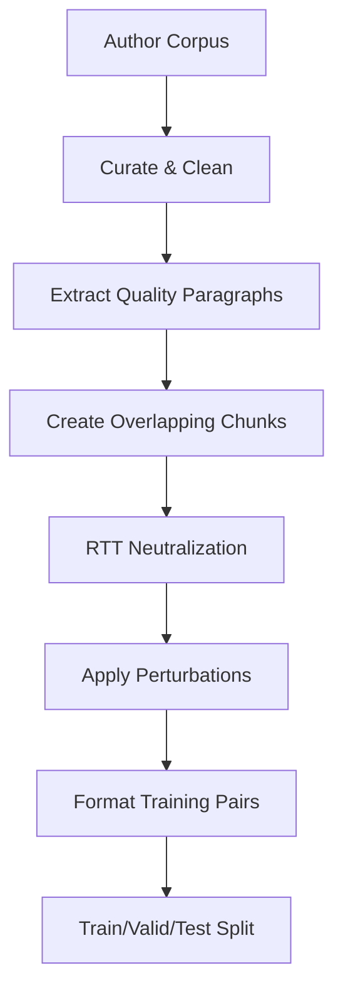
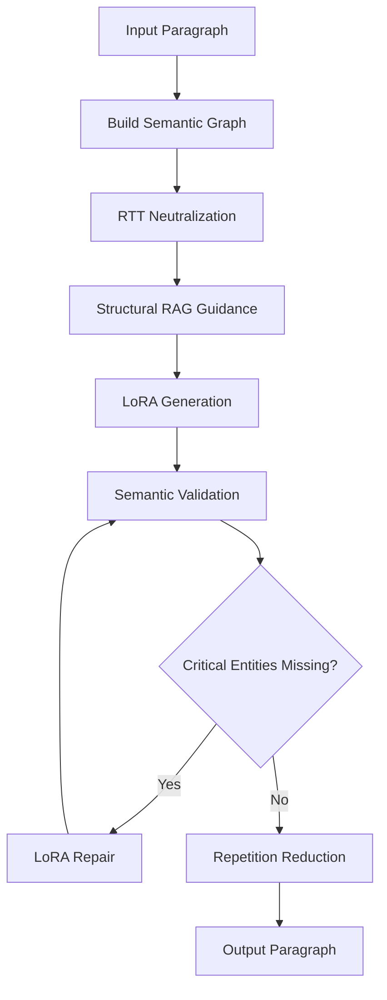

# Architecture: Style Transfer via LoRA Fine-Tuning

This document provides a deep technical explanation of the style transfer system, covering both training and inference pipelines in sufficient detail for reproducibility.

---

## Part 1: LoRA Training

### Overview

The goal is to train a LoRA adapter that captures an author's writing style such that:
- Given **neutral prose** describing some content
- The model outputs **styled prose** in the author's voice

The key insight is that training data format is critical. Using `(neutral → styled)` pairs teaches the model to **transform** rather than **memorize**.

### Why Round-Trip Translation (RTT)?

Style transfer requires teaching the model what "style" means separate from "content". The challenge: how do you create neutral versions of styled text without losing information?

**Failed approaches:**
1. **Summarization** - Loses facts, teaches compression not style
2. **OpenIE triples** - "Subject-Verb-Object" extraction is lossy
3. **Manual rewriting** - Doesn't scale, inconsistent

**Solution: Round-Trip Translation via Mandarin**

RTT exploits linguistic distance to strip style while preserving facts:

```
Styled English → Mandarin (HSK5) → Neutral English
```

**Why Mandarin works:**

1. **Grammar distance**: Mandarin's Topic-Prominent structure can't support nested English clauses. Complex syntax flattens automatically.

2. **No cognates**: Unlike French/Spanish, Mandarin shares no vocabulary roots with English. Literary words like "cyclopean" become 巨大的 (huge) → "huge" in translation.

3. **HSK5 vocabulary constraint**: Limiting to ~5000 common words strips archaic/literary vocabulary.

4. **Natural output**: Unlike graph-based extraction, RTT produces fluent neutral prose that serves as good training input.

**Example:**

```
Styled (Lovecraft):
"The cyclopean masonry of that blasphemous edifice spoke of
eons predating mankind's feeble scratching upon this globe."

After RTT:
"The huge stone building was very old. It was built long
before humans lived on Earth."
```

All facts preserved. All style stripped.

### Corpus Requirements

**Optimal size: 600K-900K tokens (~150KB-300KB raw text)**

| Size | Effect |
|------|--------|
| < 300K tokens | Underfitting - style not captured |
| 600K-900K tokens | Optimal - style captured, no memorization |
| > 1.5M tokens | Diminishing returns, longer training |

**Quality criteria for paragraphs:**

```python
min_words: 100        # Skip fragments
max_words: 650        # Avoid very long passages
min_sentences: 2      # Need multiple sentences for rhythm
max_special_char_ratio: 0.10  # Avoid code/tables
max_word_repetition_ratio: 0.55  # Avoid repetitive text
```

**Paragraph selection for diversity:**

Use `scripts/select_diverse_paragraphs.py` to select paragraphs that maximize:
1. **Sentence length variance** - Captures author's rhythm
2. **Vocabulary richness** - Captures distinctive words
3. **Syntactic complexity** - Captures clause patterns

### Training Data Generation Pipeline



#### Step 1: Curate Corpus

```bash
python scripts/curate_corpus.py \
    --input data/corpus/author_raw.txt \
    --output data/corpus/author.txt \
    --target-tokens 900000
```

**What this does:**
- Removes chapter headers, page numbers, footnotes
- Normalizes unicode (smart quotes → straight quotes)
- Filters paragraphs by quality criteria
- Selects diverse paragraphs up to token target

#### Step 2: Generate Training Data

```bash
python scripts/generate_flat_training.py \
    --corpus data/corpus/author.txt \
    --author "Author Name" \
    --output data/training/author
```

**Pipeline stages:**

**Stage 1: Overlapping Chunks (Style Lives in Transitions)**

Research shows stylistic markers concentrate at sentence boundaries. Instead of treating paragraphs as atomic units, create overlapping chunks:

```
Config:
  min_words: 150
  max_words: 400
  overlap_sentences: 2
```

A corpus of 100 paragraphs might yield 200+ overlapping chunks, exposing the model to more opening/closing patterns.

**Stage 2: RTT Neutralization**

Each chunk goes through the RTT pipeline:

```
Prompt (rtt_deepseek.txt):
  STEP 1 - Translate to simple Mandarin (HSK 5 vocabulary)
  STEP 2 - Translate back to plain English (SVO structure)

  CRITICAL: Output MUST be AT LEAST as long as input
  EVERY fact, figure, date, name MUST appear in output
```

Uses DeepSeek API for speed (batch_size=10, concurrent_batches=4).

**Stage 3: Perturbation (NEFTune Simulation)**

NEFTune adds noise to embeddings during training. We simulate this in the input:

```python
# 8% perturbation rate for standard entries
perturbation_types:
  - Synonym swap: "big" → "large" (40%)
  - Word drop: Remove "the", "a", "very" (30%)
  - Typo: Swap adjacent chars (30%)
```

This prevents overfitting to exact input phrasing.

**Stage 4: Format Training Pairs**

Final format for base model training:

```
Rewrite in {author}'s style (~{word_count} words):
[STYLE: Varied Lengths | Complex Syntax]
{neutral_text_with_perturbations}
###
{original_styled_text}
```

The `###` marker tells the model where the prompt ends and completion begins. With `mask_prompt=true` in training, only the completion is trained.

#### Step 3: Train LoRA Adapter

```bash
python scripts/train_mlx_lora.py \
    --from-neutralized data/training/author/train.jsonl \
    --author "Author Name" \
    --train \
    --output lora_adapters/author
```

**LoRA hyperparameters:**

| Parameter | Recommended | Notes |
|-----------|-------------|-------|
| `rank` | 64 | Higher = more capacity, more memory |
| `alpha` | 128 | Typically 2x rank |
| `learning_rate` | 1e-5 | Lower for style (not factual) learning |
| `epochs` | 1 | Often sufficient, check validation loss |
| `batch_size` | 1 | Memory dependent |

**Base model selection:**

| Model | Memory | Quality |
|-------|--------|---------|
| `Qwen3-8B-4bit` | ~8GB | Good balance |
| `Qwen3-8B-Base-bf16` | ~16GB | Higher quality |
| `Llama-3.1-8B-4bit` | ~8GB | Alternative |

Training produces:
```
lora_adapters/author/
├── adapters.safetensors  # LoRA weights
├── adapter_config.json   # LoRA config
└── metadata.json         # Training metadata (author, epochs, etc.)
```

### Validation During Training

Monitor validation loss. If it starts increasing while training loss decreases → overfitting.

**Signs of good training:**
- Validation loss decreases then stabilizes
- Generated samples show style variation (not exact memorization)
- Different inputs produce different outputs with same style

**Signs of problems:**
- Validation loss increases → reduce epochs or learning rate
- Output matches training examples verbatim → reduce rank or epochs
- Output ignores input content → increase training data diversity

---

## Part 2: Inference Pipeline

### Overview



### Step 1: Build Source Semantic Graph

Before any transformation, extract the "ground truth" from the source:

```python
builder = SemanticGraphBuilder(use_rebel=False)
source_graph = builder.build_from_text(paragraph)
```

The graph contains:
- **Proposition nodes**: Subject-Predicate-Object triples
- **Entity nodes**: Named entities (people, places, dates, numbers)
- **Relationships**: Logical connections between propositions

This graph is used later to verify the output preserves all facts.

### Step 2: RTT Neutralization

**Why neutralize during inference?**

The LoRA was trained on `(neutral → styled)` pairs. If you feed it styled text, it might:
- Get confused by existing style markers
- Try to "double-style" the input
- Produce inconsistent results

By RTT-neutralizing first, we match the training distribution.

```python
# From transfer.py
if self.config.skip_neutralization:
    content_for_generation = paragraph
else:
    content_for_generation = self._rtt_neutralize(paragraph)
```

**RTT prompt (rtt_deepseek.txt):**

```
You are performing style neutralization via round-trip translation.

CRITICAL REQUIREMENTS:
1. Output MUST be AT LEAST as long as input
2. EVERY fact, figure, date, name, statistic MUST appear in output
3. Do NOT summarize or condense

STEP 1 - Translate to simple Mandarin (HSK 5 vocabulary)
STEP 2 - Translate back to plain English (SVO structure)

Output ONLY the final English.
```

**Configuration:**
```json
"deepseek_rtt": {
  "model": "deepseek-chat",
  "temperature": 0.1,    // Low for consistency
  "batch_size": 10,
  "concurrent_batches": 4
}
```

### Step 3: Structural RAG Guidance

Before generating, retrieve rhythm patterns from the author's corpus:

```python
if self.structural_rag:
    guidance = self.structural_rag.get_guidance(paragraph)
    structural_guidance = guidance.format_for_prompt()
```

**What Structural RAG provides:**

```
STRUCTURAL GUIDANCE:
Rhythm patterns from author's corpus:
- Vary sentence length: 5, 23, 8, 31, 12 words
- Use punctuation: semicolons (;), em-dashes (—)
- Start some sentences with conjunctions: "And", "But", "Yet"
```

This gives the model concrete structural targets beyond just "write like X".

### Step 4: LoRA Generation

The core style transfer happens here:

```python
output = self.generator.generate(
    content=content_for_generation,  # Neutral text
    author=self.author,
    max_tokens=max_tokens,
    target_words=target_words,
    structural_guidance=structural_guidance,
)
```

**Generation prompt (style_transfer.txt):**

```
You are {author}. Your prose is deliberately UNEVEN and human.

MANDATORY RULES:
1. VARY SENTENCE LENGTH: Follow long sentences (25+ words) with short ones (under 8 words)
2. USE SHORT SENTENCES: "A mask." "The horror." Single words work.
3. BANNED WORDS: Never use "Furthermore," "Moreover," "Additionally"
4. USE PUNCTUATION: Dashes (—) and semicolons (;) break rhythm
5. SUBJECTIVE VOICE: Filter facts through emotion
6. PRESERVE ALL facts, propositions, figures exactly.

{structural_guidance}

Write the following narrative using your distinctive voice:

{content}
###
```

**Key parameters:**

```json
"mlx": {
  "temperature": 0.2,      // Low for consistency
  "top_p": 0.9,
  "max_tokens": 256,
  "repetition_penalty": 1.1
}
```

### Step 5: Semantic Validation

After generation, compare output graph to source graph:

```python
output_graph = builder.build_from_text(output)
diff = comparator.compare(source_graph, output_graph)

if diff.missing_nodes:
    # Some propositions weren't preserved
    missing_entities = self._extract_critical_entities(diff.missing_nodes)
```

**What triggers repair:**

| Condition | Action |
|-----------|--------|
| No differences | Accept output |
| Missing propositions, no entities | Accept (vocabulary changes OK) |
| Missing named entities | Trigger LoRA repair |
| Contradictions | Trigger LoRA repair |

**Critical distinction:** Vocabulary changes are expected and desired ("big" → "cyclopean"). Only missing **named entities** (people, places, organizations, numbers, dates) trigger repair.

### Step 6: Style-Preserving Repair

If critical entities are missing, repair using the **same LoRA** (not a generic LLM):

```python
# Create repair content with entity hints
entity_hint = f"[MUST INCLUDE: {', '.join(missing_entities)}]"
repair_content = f"{entity_hint}\n\n{source}"

# Regenerate through LoRA (maintains style)
repaired = self.generator.generate(
    content=repair_content,
    author=self.author,
    target_words=target_words,
)
```

**Why LoRA repair, not DeepSeek?**

A generic LLM (DeepSeek) doesn't know the author's style. Using it for repair would overwrite the carefully crafted Lovecraftian prose with generic text:

```
Before fix (DeepSeek repair):
  Input: "The cyclopean edifice..."
  Repair: "The large building..."  ← Style destroyed!

After fix (LoRA repair):
  Input: "The cyclopean edifice..."
  Repair: "The vast, cyclopean structure..."  ← Style preserved!
```

### Step 7: Repetition Reduction

LLMs often overuse certain words. Post-process to fix:

```python
if self.config.reduce_repetition:
    output, words_replaced = self.reducer.reduce_repetition(
        output,
        threshold=self.config.repetition_threshold
    )
```

**What gets replaced:**
- Words appearing 3+ times (configurable)
- Common LLM-speak: "intricate", "tapestry", "testament"
- Repetitive sentence starters

### Configuration Reference

```json
{
  "generation": {
    // Meaning preservation
    "entailment_threshold": 0.8,
    "max_repair_attempts": 1,

    // Length control
    "max_expansion_ratio": 3.0,
    "target_expansion_ratio": 1.2,

    // LoRA influence
    "lora_scale": 1.0,  // 0.5-2.0 range

    // Neutralization
    "skip_neutralization": false,

    // Post-processing
    "reduce_repetition": true,
    "repetition_threshold": 3,

    // Document handling
    "use_document_context": true,
    "pass_headings_unchanged": true,
    "min_paragraph_words": 10,

    // RAG
    "use_structural_rag": true,

    // NLI Auditor (optional)
    "use_sentence_nli": false,
    "nli_model": "cross-encoder/nli-deberta-v3-base"
  }
}
```

---

## Reproducibility Checklist

### Training

1. **Corpus preparation:**
   - [ ] Clean text (remove headers, normalize unicode)
   - [ ] Filter paragraphs (100-650 words, 2+ sentences)
   - [ ] Select diverse paragraphs (sentence variance, vocabulary)
   - [ ] Target 600K-900K tokens

2. **Training data generation:**
   - [ ] Create overlapping chunks (150-400 words, 2-sentence overlap)
   - [ ] RTT neutralize via DeepSeek (preserve all facts)
   - [ ] Apply perturbations (8% rate)
   - [ ] Format as base model text completion

3. **LoRA training:**
   - [ ] Use rank=64, alpha=128
   - [ ] Use learning_rate=1e-5
   - [ ] Train 1 epoch, monitor validation loss
   - [ ] Verify outputs show style, not memorization

### Inference

1. **Input processing:**
   - [ ] Skip headings and short paragraphs
   - [ ] Build semantic graph for validation

2. **Style transfer:**
   - [ ] RTT neutralize input (match training distribution)
   - [ ] Get structural guidance from RAG
   - [ ] Generate via LoRA with author prompt

3. **Validation:**
   - [ ] Compare semantic graphs
   - [ ] Only repair for missing entities (not vocabulary)
   - [ ] Use LoRA for repair (preserve style)

4. **Post-processing:**
   - [ ] Reduce repetition
   - [ ] Check expansion ratio

---

## Common Issues and Solutions

| Issue | Cause | Solution |
|-------|-------|----------|
| Output matches training data | Memorization | Reduce epochs, lower rank, add more training data |
| Style too weak | Underfitting | Train longer, increase lora_scale |
| Facts being changed | Over-styling | Lower lora_scale, increase entailment_threshold |
| Style destroyed during repair | Wrong repair method | Ensure repair uses LoRA, not generic LLM |
| Numbers converted to words | LoRA quirk | Lower lora_scale to 0.5-0.8 |
| Repetitive phrases | LLM tendency | Enable reduce_repetition, lower threshold |
